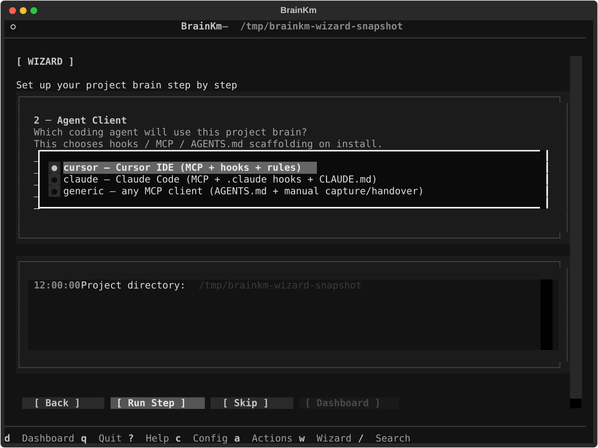
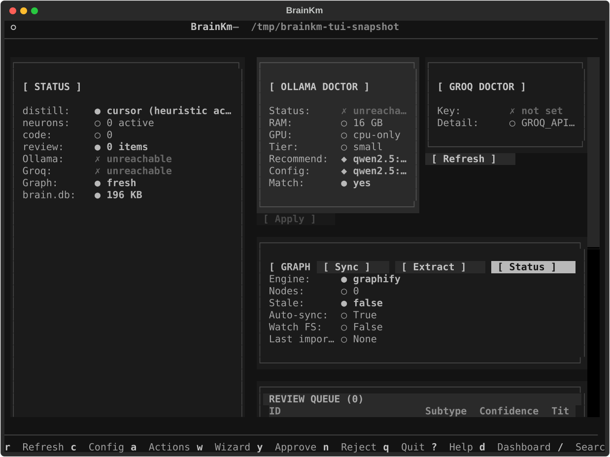
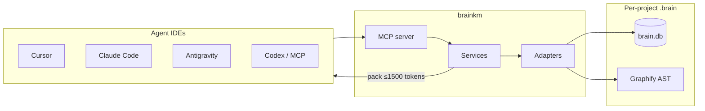

<div align="center">


# MemNetwork

**Local project memory for agentic coding IDEs.**

One SQLite brain. Eight MCP tools. Thin host adapters.  
The `brainkm` package remembers *why* you chose something, maps how your code connects, and injects bounded context — so agents stop re-reading files and re-explaining past decisions, even after chat compaction.

[](brainkm/pyproject.toml)
[](brainkm/pyproject.toml)
[](LICENSE)
[](docs/FEATURES.md)

[Features](docs/FEATURES.md) · [Install](docs/INSTALL.md) · [Benchmarks](docs/BENCHMARKS.md) · [Architecture](docs/AI_PROJECT_BRIEF.md) · [Security](docs/SECURITY.md)

</div>

---

## Table of contents

- [Why MemNetwork](#why-memnetwork)
- [Demo](#demo)
- [Features](#features)
- [How it works](#how-it-works)
- [Quick start](#quick-start)
- [Usage](#usage)
- [Benchmarks](#benchmarks)
- [Documentation](#documentation)
- [Status](#status)
- [Contributing](#contributing)
- [License](#license)

---

## Why MemNetwork

Long agent sessions burn tokens and lose context. Compaction summarizes the chat and drops decisions you already debated. Host Memories and rules help — but they are not a searchable, graph-aware **project brain**.

- **Stop re-explaining pivots** — “we chose JWT over sessions” lives in neurons, not only in chat history
- **Stop dumping whole modules** — bounded `context_pack` (≤1500 tokens) instead of five-file reads
- **Survive compaction** — PreCompact handover + SessionEnd capture keep truth in SQLite
- **One brain, many hosts** — same `.brain/` across Cursor, Claude Code, Antigravity, Codex, and any MCP client

MemNetwork is **not** a Cursor plugin and **not** a second `@codebase`. Cursor is one first-class host (deepest today while we dogfood there). The brain and MCP API stay the same; adapters fill host gaps.

---

## Demo

Optional guided UI (`brainkm[tui]` → `brainkm configure`):

<p align="center">
  
  
</p>

<p align="center"><sub>Guided setup is optional. Explore the graph anytime with core <code>brainkm viz</code> — no extra install.</sub></p>

<!-- Future: animated GIF of `brainkm configure` (vhs / ScreenToGif) -->

---

## Features

### Remember project truth
- Hooks + `auto_observe` fill the brain (SessionEnd distill, PostToolUse observations)
- Neurons for facts, decisions, rules, and known errors — inspectable SQLite rows
- Supersede / conflict handling so new truth replaces old
- `remember` is **pin or correct only** — not the everyday store path

### Navigate code structure
- Graphify AST graph: files, classes, functions, import/call edges
- `traverse` for blast-radius; `context_pack` for task-scoped neighborhoods
- Auto-sync after Write/Edit (debounced)
- **`brainkm viz`** — included browser graph explorer (no optional extra)

### Survive long sessions
- SessionStart injection, PreCompact handover, SessionEnd distill
- Manual fallbacks: `brainkm handover`, `brainkm capture`

### Smart retrieval
- Zero-LLM default: FTS5 BM25 + weighted PPR graph activation
- Optional MiniLM hybrid via `[semantic]`
- Hard ≤1500-token agent-facing packs; abstention on low confidence

### Multi-host, local-first
- Adapters: Cursor · Claude Code · Antigravity · Codex · generic MCP
- **Guided TUI** (`[tui]` extra) — recommended, not required
- Secrets redacted on write and before injection — brain stays on disk

Full catalog → [docs/FEATURES.md](docs/FEATURES.md)

---

## How it works



| Layer | Role |
|-------|------|
| **Memory** | SQLite FTS5 neurons — decisions, rules, facts, errors |
| **Code graph** | Graphify AST neighbors for `traverse` / packs |
| **MCP** | stdio or localhost HTTP — 8 agent-facing tools |
| **CLI / TUI** | Typer core; Textual configure when `[tui]` is installed |

**Layering:** MCP tool → service → adapter → SQLite. Deep dive → [docs/AI_PROJECT_BRIEF.md](docs/AI_PROJECT_BRIEF.md)

<details>
<summary><strong>When to use which tool</strong></summary>

| Question | Use first |
|----------|-----------|
| Where is symbol X defined? | Host codebase index / Grep |
| Why did we choose X over Y? | **`recall`** |
| What calls / imports X? | **`traverse`** |
| Understand one module (3+ files) | **`context_pack`**, then verify in source |
| Pin a decision / fix bad memory | **`remember`** |
| Cross-project prefs / static policy | Host Memories / rules — not brainkm |

</details>

---

## Quick start

**Prerequisites:** Python 3.11 or 3.12.

### 1. Clone and install

```bash
git clone <your-remote-url> MemNetwork
cd MemNetwork

bash brainkm/scripts/setup_dev.sh
source .venv/bin/activate
```

### 2. Configure your IDE(s)

**Recommended** — optional guided TUI:

```bash
pip install -e "./brainkm[tui]"
brainkm configure
```

- **One app** → that host starts the brain (stdio). No extra terminal.
- **Two or more** → shared localhost brain; click **Start Brain** once from the TUI.

**Without TUI** — core CLI only:

```bash
brainkm install --dev --client cursor   # or claude | antigravity | codex | generic
brainkm graph sync                      # optional first code graph
brainkm doctor
```

### 3. Reload MCP and use it

Restart the IDE or reload MCP servers. Ask the agent (or call tools) using the [Usage](#usage) table below.

```bash
brainkm version   # expect 0.8.1
```

Full setup notes → [docs/INSTALL.md](docs/INSTALL.md)

### Optional extras

| Extra | What you get |
|-------|----------------|
| `[tui]` | `brainkm configure` guided wizard / dashboard |
| `[semantic]` | MiniLM hybrid retrieval (`brainkm semantic doctor`) |
| `[graphify]` | Graphify AST extract (also pulled by `setup_dev.sh`) |

`brainkm viz` needs **none** of these — it ships with core.

> **Public install:** PyPI / `uvx` one-liner is deferred until the repo is public and the installable package name is finalized. Local path today: clone + editable install. Checklist → [docs/PUBLIC_RELEASE_CHECKLIST.md](docs/PUBLIC_RELEASE_CHECKLIST.md)

---

## Usage

| Question | Tool |
|----------|------|
| Why did we choose X? | `recall` |
| What calls / imports X? | `traverse` |
| Understand this module without dumping files | `context_pack` |
| Pin a decision / fix bad memory | `remember` |

<details>
<summary><strong>MCP tools (5)</strong></summary>

| Tool | Purpose |
|------|---------|
| `remember` | Pin / correct / archive (`action`); correct writes supersedes |
| `recall` | Hybrid search + `decision_trail`; abstains on low confidence |
| `context_pack` | Task pack under token budget; auto-queues stale graph refresh |
| `traverse` | Impact analysis: neighborhood + `impact_summary` + linked neurons |
| `brain_stats` | Health: counts, usage, abstention, dead neurons, hygiene hint |

</details>

<details>
<summary><strong>Hosts and complementarity</strong></summary>

| Host | Role today |
|------|------------|
| **Any MCP client** | Core contract: 6 tools + optional `brainkm serve` |
| **Cursor** | Deepest maturity (hooks, PreCompact, distill) |
| **Claude Code** | First-class hooks + MCP; distill via `claude -p` |
| **Antigravity** | First-class `.agents/` MCP (`serverUrl`) + hooks; Stop distill into project `.brain/` (`--project-dir` / auto-heal); extractor via `capture.distill_mode` |
| **Codex CLI** | First-class `.codex/config.toml` + hooks; Stop → session-end; distill via `codex exec` |
| **generic** | Connect / example MCP wiring; manual capture/handover |

| Job | Prefer |
|-----|--------|
| Cross-project user prefs | Host Memories |
| Static team policy | Host rules (`CLAUDE.md`, `.cursor/rules`, …) |
| “Where is symbol X?” | Host codebase index / Grep |
| “Why did we choose X?” | **brainkm `recall`** |
| “What calls X?” | **brainkm `traverse` / `context_pack`** |
| Hosted multi-tenant memory | Mem0 / Zep — not the goal here |

</details>

---

## Benchmarks

Public comparison uses **Common Memory Axes (CMA)** — ability accuracy + pack tokens + latency — for a coding-agent project brain (not a chat-assistant leaderboard).

Latest CMA v3 (brainkm **0.4.1**, semantic off) — [full scorecard](docs/benchmarks/2026-07-18-cma-v3.md):

| Metric | Result |
|--------|--------|
| Ability micro-avg | **96.7%** (hard subset **93.8%**) |
| Mean pack tokens | **~322** / 1500 |
| Recall / pack p95 | **~8 / 14 ms** |
| vs BM25 / title-scan | brain **1.00** vs **0.88** / **0.83** |
| Decision + structure | **8/8** |

Product eval highlights: task success **23/23**, gold-fact coverage **100%** with brain vs **85%** selective-read, token proxy **~15.7×** vs naive multi-file dump.

```bash
brainkm bench run cma     # public scorecard
brainkm bench run eval    # product IR + task + latency
```

Methodology and what we refuse to claim → [docs/BENCHMARKS.md](docs/BENCHMARKS.md)

---

## Documentation

| Doc | Contents |
|-----|----------|
| [FEATURES.md](docs/FEATURES.md) | Full feature catalog |
| [INSTALL.md](docs/INSTALL.md) | Clone + editable setup |
| [AI_PROJECT_BRIEF.md](docs/AI_PROJECT_BRIEF.md) | Architecture + roadmap |
| [BENCHMARKS.md](docs/BENCHMARKS.md) | CMA scorecard + eval targets |
| [CLI_COMMANDS.md](docs/CLI_COMMANDS.md) | CLI reference |
| [SECURITY.md](docs/SECURITY.md) | Redaction posture |
| [AGENTS.md](AGENTS.md) | Agent entry point |
| [brainkm/README.md](brainkm/README.md) | Package / development notes |

---

## Status

**brainkm 0.8.1** — Project brain with six MCP tools (`remember` pin/correct/archive, `recall` + decision trail, `context_pack`, `traverse` impact, `brain_stats`, `trace_changes`), first-class Cursor / Claude / Antigravity / Codex CLI hosts (Codex: `config.toml` MCP + `codex exec` distill; AGY Stop routes into the project `.brain/`), git commit↔session joins (`git-note` / post-commit hook), hardened shared HTTP, viz access tokens, and included `brainkm viz`.

- [x] Local SQLite brain + 5 MCP tools
- [x] Cursor / Claude / Antigravity / Codex adapters
- [x] Compaction survival (PreCompact + SessionEnd)
- [x] Shared HTTP MCP Bearer auth + loopback bind guards
- [x] CMA public scorecard + product eval suites
- [ ] PyPI / `uvx` one-liner (deferred — name + public repo)
- [ ] MCP Registry / host one-click installers (deferred)

---

## Contributing

See [CONTRIBUTING.md](CONTRIBUTING.md). Contributions require agreeing to the [CLA](CLA.md).

---

## License

Apache License 2.0 — see [LICENSE](LICENSE) and [NOTICE](NOTICE).  
Copyright © 2026 Noyal Bastin Benny.

<p align="right"><a href="#memnetwork">Back to top</a></p>
