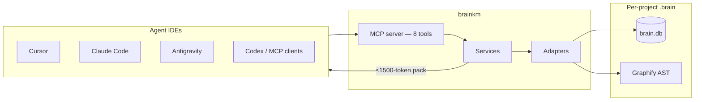

# MemNetwork

**Local project memory for agentic coding IDEs.**

One SQLite brain. Eight MCP tools. Thin host adapters.  
brainkm remembers *why* you chose something, maps how your code connects, and injects bounded context — so agents stop re-reading files and re-explaining past decisions, even after chat compaction.

| | |
|---|---|
| **Version** | `0.4.2` |
| **Package** | `brainkm` (MCP server + CLI) |
| **Storage** | `.brain/brain.db` per project |
| **License** | [Apache-2.0](LICENSE) |
| **Python** | 3.11+ |

---

## Why MemNetwork

Long agent sessions burn tokens and lose context. Compaction summarizes the chat and drops decisions you already debated. Host Memories and rules help — but they are not a searchable, graph-aware **project brain**.

| Problem | What brainkm does |
|---------|-------------------|
| Re-explaining pivots every session | Distills decisions into searchable neurons |
| Dumping five files to understand one module | Bounded `context_pack` (≤1500 tokens) |
| Compaction erases architectural truth | PreCompact handover + SessionEnd capture |
| Weak / noisy retrieval pollutes the chat | Abstention, noise gates, usage feedback |
| Switching IDEs forks memory | One `.brain/` shared across hosts |

brainkm is **not** a Cursor plugin and **not** a second `@codebase`. Cursor is one first-class host (deepest today while we dogfood there). The same brain works with Claude Code, Antigravity, Codex, and any MCP client.

---

## Features

### Remember project truth
- Hooks + `auto_observe` fill the brain automatically (SessionEnd distill, PostToolUse observations)
- Neurons for facts, decisions, rules, and known errors — inspectable SQLite rows
- Supersede / conflict handling so new truth replaces old instead of stacking contradictions
- `remember` is **pin or correct only** — not the everyday store path

### Navigate code structure
- Graphify AST graph: files, classes, functions, import/call edges
- `traverse` for blast-radius (“what calls X?”)
- `context_pack` for task-scoped neighborhoods + decisions under a hard token cap
- Auto-sync after Write/Edit (debounced)

### Survive long sessions
- SessionStart injection (frozen pack for prefix cache)
- PreCompact / synthetic-precompact handover before lossy summarize
- SessionEnd / idle Stop distill so truth survives the tab
- Manual fallbacks: `brainkm handover`, `brainkm capture`

### Smart retrieval
- Zero-LLM default: FTS5 BM25 + weighted PPR graph activation
- Optional MiniLM hybrid (RRF) when you enable `[semantic]`
- Hard ≤1500-token agent-facing packs; summary-first gists
- Intent-aware budgets; abstention on low confidence

### Multi-host, local-first
- Guided TUI: `brainkm configure` — pick apps → Start Brain if sharing
- Adapters: Cursor · Claude Code · Antigravity · Codex · generic MCP
- Secrets redacted on write and before injection — brain stays on disk

Full catalog → [docs/FEATURES.md](docs/FEATURES.md)

---

## Architecture



| Layer | Technology | Role |
|-------|------------|------|
| **Memory** | SQLite FTS5 | Neurons — decisions, rules, facts, errors |
| **Code graph** | Graphify AST | Structural neighbors for `traverse` / packs |
| **MCP** | stdio or localhost HTTP | Agent-facing tools |
| **CLI / TUI** | Typer + Textual | install, serve, configure, bench, hygiene |
| **Optional** | sqlite-vec + MiniLM | Semantic hybrid when enabled |

**Layering rule:** MCP tool → service → adapter → SQLite. Never skip layers.

Details → [docs/AI_PROJECT_BRIEF.md](docs/AI_PROJECT_BRIEF.md)

---

## Quick start

### 1. Clone and install

```bash
git clone <your-remote-url> MemNetwork
cd MemNetwork

bash brainkm/scripts/setup_dev.sh
source .venv/bin/activate
pip install -e "./brainkm[tui]"
```

### 2. Configure your IDE(s)

```bash
brainkm configure
```

- **One app** → that host starts the brain for you (stdio). No extra terminal.
- **Two or more** → shared localhost brain; click **Start Brain** once from the TUI.

Or wire a single client directly:

```bash
brainkm install --dev --client cursor      # or claude | antigravity | codex | generic
brainkm graph sync                          # optional first code graph
brainkm doctor
brainkm version                             # expect 0.4.2
```

### 3. Use it in chat

Ask the agent (or call tools yourself):

| Question | Tool |
|----------|------|
| Why did we choose X? | `recall` |
| What calls / imports X? | `traverse` |
| Understand this module without dumping files | `context_pack` |
| Pin a decision / fix bad memory | `remember` |

Reload MCP after install. Full setup notes → [docs/INSTALL.md](docs/INSTALL.md)

### Optional: semantic hybrid

```bash
pip install -e "./brainkm[semantic]"
brainkm semantic doctor
```

---

## MCP tools

| Tool | Purpose |
|------|---------|
| `remember` | Pin durable truth or correct a wrong auto-capture |
| `recall` | Hybrid search; abstains on low confidence |
| `context_pack` | Task pack (graph + neurons) under token budget |
| `traverse` | Focused AST neighborhood (callers / callees / imports) |
| `session_status` | Read/write current session context |
| `forget` | Soft-archive a neuron |
| `brain_stats` | Health: counts, usage, abstention, dead neurons |
| `graph_sync` | Refresh Graphify extract + import |

---

## Benchmarks

Public comparison uses **Common Memory Axes (CMA)** — ability accuracy + pack tokens + latency — built for a coding-agent project brain (not a chat-assistant leaderboard).

Latest CMA v3 (brainkm **0.4.1**, semantic off) — [full scorecard](docs/benchmarks/2026-07-18-cma-v3.md):

| Metric | Result |
|--------|--------|
| Ability micro-avg | **96.7%** (hard subset **93.8%**) |
| Mean pack tokens | **~322** / 1500 |
| Recall / pack p95 | **~8 / 14 ms** |
| vs BM25 / title-scan | brain **1.00** vs **0.88** / **0.83** |
| Hard-slice lift | **+0.45** vs BM25 (paraphrase / bridge) |
| Decision + structure | **8/8** |

Product eval highlights (project brain):

| Suite | Result |
|-------|--------|
| Task success (with brain) | **23/23 (100%)** — all `answer_facts` in pack ≤1500 |
| Gold-fact coverage | **100%** with brain vs **85%** selective-read baseline |
| Token proxy (`compare`) | **~15.7×** average vs naive multi-file dump |
| Retrieval (gold corpus) | Recall@1 / @5 **0.80 / 0.91**, MRR **0.94** |

Reproduce:

```bash
brainkm bench run cma          # public scorecard
brainkm bench run eval         # product IR + task + latency
```

Methodology, baselines, and what we refuse to claim → [docs/BENCHMARKS.md](docs/BENCHMARKS.md)

---

## Hosts

| Host | Role today |
|------|------------|
| **Any MCP client** | Core contract: 8 tools + optional `brainkm serve` |
| **Cursor** | Deepest maturity (hooks, PreCompact, distill) |
| **Claude Code** | First-class hooks + MCP; silent memory path |
| **Antigravity** | First-class `.agents/` MCP (`serverUrl`) + hooks |
| **Codex / generic** | Connect / MCP wiring |

Parity follows what each IDE exposes. The brain and MCP API stay the same; adapters fill gaps.

### Complementary, not competing

| Job | Prefer |
|-----|--------|
| Cross-project user prefs | Host Memories |
| Static team policy | Host rules (`CLAUDE.md`, `.cursor/rules`, …) |
| “Where is symbol X?” | Host codebase index / Grep |
| “Why did we choose X?” | **brainkm `recall`** |
| “What calls X?” | **brainkm `traverse` / `context_pack`** |
| Hosted multi-tenant memory | Mem0 / Zep — not the goal here |

---

## Documentation

| Doc | Contents |
|-----|----------|
| [FEATURES.md](docs/FEATURES.md) | Full feature catalog |
| [INSTALL.md](docs/INSTALL.md) | Clone + editable setup |
| [AI_PROJECT_BRIEF.md](docs/AI_PROJECT_BRIEF.md) | Architecture + roadmap |
| [BENCHMARKS.md](docs/BENCHMARKS.md) | CMA scorecard + eval targets |
| [CLI_COMMANDS.md](docs/CLI_COMMANDS.md) | CLI reference |
| [SECURITY.md](docs/SECURITY.md) | Redaction posture |
| [AGENTS.md](AGENTS.md) | Agent entry point |
| [CONTRIBUTING.md](CONTRIBUTING.md) | How to contribute |

---

## Status & distribution

**brainkm 0.4.2** — Multi-host project brain with Antigravity first-class support, Claude silent memory, shared localhost brain, guided TUI, and eight MCP tools.

PyPI / `uvx` one-liner, MCP Registry listing, and host one-click installers remain **deferred** until the repository is public and the installable package name is finalized. Local path today: clone + `brainkm install --dev`.

Checklist → [docs/PUBLIC_RELEASE_CHECKLIST.md](docs/PUBLIC_RELEASE_CHECKLIST.md)

---

## License

Apache License 2.0 — see [LICENSE](LICENSE) and [NOTICE](NOTICE).  
Copyright © 2026 Noyal Bastin Benny.

Contributions require agreeing to the [CLA](CLA.md). See [CONTRIBUTING.md](CONTRIBUTING.md).
