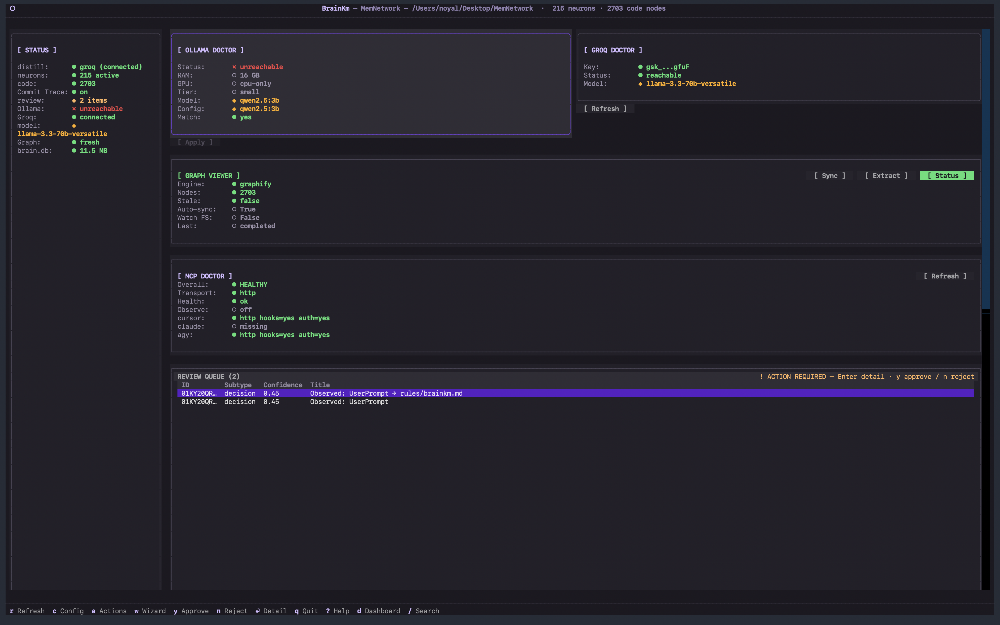
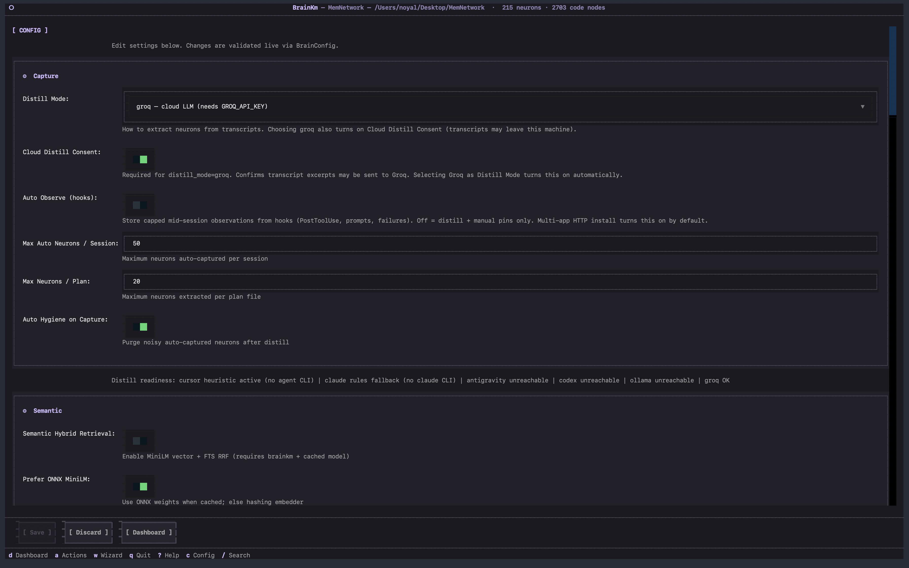
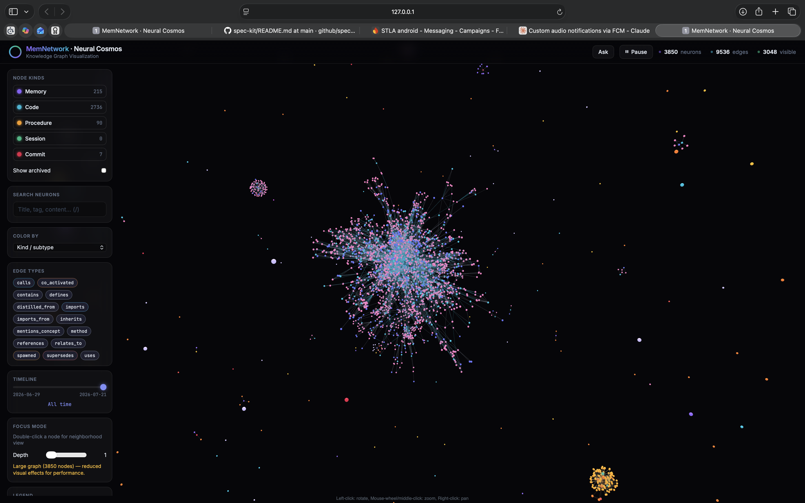
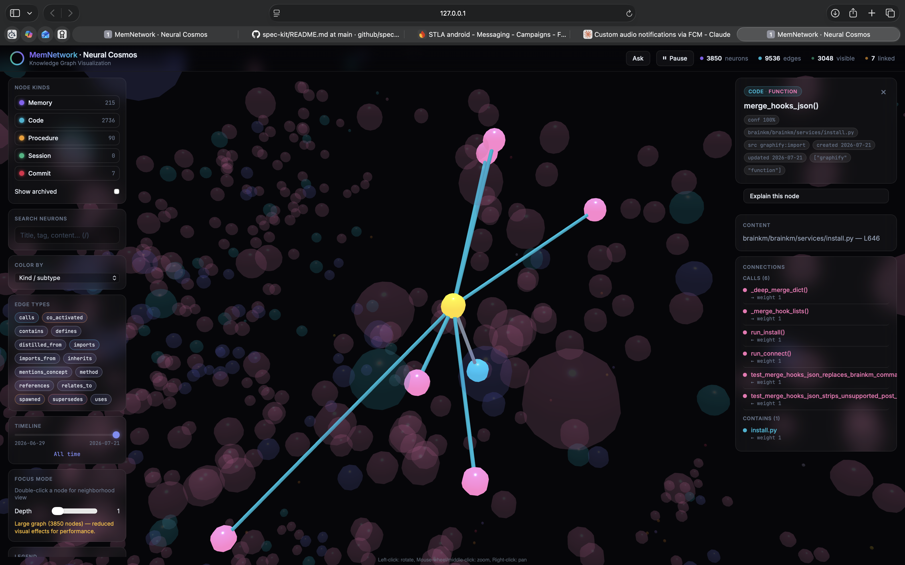
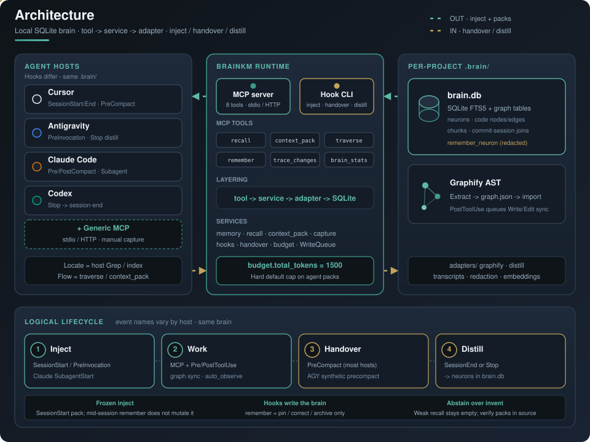

<div align="center">


# MemNetwork

**Local project memory for agentic coding IDEs.**

One SQLite brain. Eight MCP tools. Bounded context packs.  
Survive chat compaction — share memory across Cursor, Antigravity, Claude Code, and Codex.

<!-- One badge per <td>: GitHub README  is display:block, so multi-img
     cells / single-line markdown still stack. Separate cells force a row. -->
<table align="center">
  <tr>
    <td><a href="brainkm/pyproject.toml"></a></td>
    <td><a href="brainkm/pyproject.toml"></a></td>
    <td><a href="LICENSE"></a></td>
    <td><a href="docs/FEATURES.md"></a></td>
    <td><a href="docs/BENCHMARKS.md"></a></td>
    <td><a href="docs/benchmarks/2026-07-21-footprint.md"></a></td>
  </tr>
  <tr>
    <td><a href="docs/install/cursor.md"></a></td>
    <td><a href="docs/install/antigravity.md"></a></td>
    <td><a href="docs/install/claude-code.md"></a></td>
    <td><a href="docs/install/codex.md"></a></td>
    <td><a href="docs/install/generic.md"></a></td>
  </tr>
</table>

<br/>

[Visual Tour](#visual-tour) · [Results](#results) · [Quick Start](#quick-start) · [Features](#features) · [How it works](#how-it-works) · [Docs](#documentation)

</div>

---

## Why MemNetwork

Agents burn tokens re-reading files and lose decisions when chat compacts. Host Memories help — but they are not a searchable, graph-aware **project brain**.

| | |
|---|---|
| **Stop re-explaining pivots** | “We chose JWT over sessions” lives in SQLite neurons, not only in chat history. |
| **Cut token dumps** | Bounded `context_pack` (≤1,500 tokens) vs naive multi-file dumps (**no agent tool loop**) — **95.2%** avg in live pack-vs-dump tests. |
| **Survive compaction** | PreCompact handover + SessionEnd distill keep truth in `.brain/brain.db`. |
| **One brain, many hosts** | Same local store across Cursor, Antigravity, Claude Code, Codex, and any MCP client (~55–70 MB idle). |

Not a Cursor plugin. Not a second `@codebase`. Cursor locates symbols; MemNetwork remembers *why* and maps *how code connects*.

---

## Visual Tour

<div align="center">

| `brainkm configure` | Host setup wizard |
|---------------------|-------------------|
|  |  |
| *Live status, graph health, review queue* | *One-click MCP + hooks for each IDE* |

| `brainkm viz` — Neural Cosmos | Blast-radius inspector |
|-------------------------------|-------------------------|
|  |  |
| *AST + memory graph in the browser* | *Calls, imports, downstream impact* |

</div>

---

## Results

**Pack-vs-dump** (naive multi-file context load vs `context_pack` — **not** a full-agent run with Grep/Read/edit tools):

| Scenario | Without brain (full file dump) | With `brainkm` | Savings |
|----------|--------------------------------|----------------|---------|
| AST class & handler lookup | 20,293 tok | **733** | **96.4%** (27.7×) |
| Hook & distill pipeline | 20,293 tok | **1,084** | **94.7%** (18.7×) |
| MCP / config query | 20,293 tok | **1,132** | **94.4%** (17.9×) |
| **Average** | **20,293** | **~983** | **95.2%** (21.4×) |

Same method on the Cursor-framed `compare` suite averages **~94%**.

**Full-agent Core A/B** (`endtask_h2h/3`, brainkm **0.9.0** — 6×2×3 schedule, `--require-mcp`):

| Host | Fixture | Pass with / without | mcp_ok | Session prompt tokens |
|------|---------|---------------------|--------|------------------------|
| **Cursor** | `endtask_v1` | **18/18** / 17/18 | **18/18** | **−30%** (71 115 vs 102 091) |
| **Antigravity** | `endtask_v1` | **18/18** / 12/18 | **18/18** | N/A (print-mode) |
| **Codex** | `endtask_memory_v1` | **18/18** / 2/18 | **18/18** | **−17%** cum. / **−10%** per round |

Every pack stays under the hard **1,500-token** cap. Typical latency: **~13–18 ms**. Idle shared server: **~55–70 MB RAM**.

Full scorecard → [docs/BENCHMARKS.md](docs/BENCHMARKS.md) · Cursor Core → [2026-07-30-endtask-cursor-core](docs/benchmarks/2026-07-30-endtask-cursor-core.md) · AGY Core → [2026-07-22-endtask-antigravity-core](docs/benchmarks/2026-07-22-endtask-antigravity-core.md) · Codex memory Core → [2026-08-03-endtask-codex-memory-core](docs/benchmarks/2026-08-03-endtask-codex-memory-core.md) · pack-vs-dump → [live run](docs/benchmarks/2026-07-21-antigravity-live.md) · [footprint](docs/benchmarks/2026-07-21-footprint.md) · CMA → [2026-07-31-cma](docs/benchmarks/2026-07-31-cma.md)

---

## Quick Start

**Prerequisites:** Python 3.11 or 3.12.

### 1. Clone and install

```bash
git clone https://github.com/noyal1234/MemNetwork.git
cd MemNetwork

bash brainkm/scripts/setup_dev.sh
source .venv/bin/activate
```

### 2. Configure your IDE(s)

**Recommended** — guided TUI:

```bash
pip install -e "./brainkm[tui]"
brainkm configure
```

- **One IDE** → silent memory; that host starts the brain for you.
- **Two or more** → shared localhost brain; use **Start Brain** once from the TUI.
- **Codex** → MCP can show **enabled** (gear often locked) while hooks are still skipped. Trust the project `.codex/` layer, then open **`/hooks`** and trust the brainkm commands — details in [install/codex.md](docs/install/codex.md).

**Without TUI** — core CLI:

```bash
brainkm install --dev --client cursor   # or claude | antigravity | codex | generic
brainkm graph sync                      # optional first code graph
brainkm doctor
```

### 3. Reload MCP and explore

Restart the IDE (or reload MCP servers), then optionally:

```bash
brainkm viz       # browser graph explorer
brainkm version   # expect 0.9.0
```

Full setup → [docs/INSTALL.md](docs/INSTALL.md) · per host → [Cursor](docs/install/cursor.md) · [Antigravity](docs/install/antigravity.md) · [Claude](docs/install/claude-code.md) · [Codex](docs/install/codex.md)

### Uninstall

`brainkm configure` → **Actions** → **[ Uninstall ]**, or from the CLI:

```bash
brainkm uninstall --dry-run             # show what would go
brainkm uninstall                       # every wired IDE; keeps .brain/
brainkm uninstall --client cursor       # just one host
brainkm uninstall --purge               # also delete .brain/ (project memory)
```

Removal is subtractive: only brainkm's MCP entry, hooks, rules and `AGENTS.md`/`CLAUDE.md`
section are stripped — anything else in those files stays. Git hooks and a running shared
brain are torn down once no host is left wired. `.brain/` is your memory and survives
unless you pass `--purge`.

---

## Features

- **Compaction survival** — SessionStart injection, PreCompact handover, SessionEnd distill (manual: `brainkm handover` / `capture`)
- **Code graph** — Graphify AST; `traverse` for blast-radius; `context_pack` for task neighborhoods; auto-sync after Write/Edit
- **Smart retrieval** — Zero-LLM default (FTS5 BM25 + weighted PPR); optional MiniLM via `[semantic]`; abstain on low confidence
- **Token compression** — Content-class pipeline on packs/egress (protect decisions; RTK-lite tool logs; session dedup); optional `[compression]` LLMLingua
- **Pin / correct only** — Hooks + `auto_observe` fill the brain; MCP `remember` is pin, correct, or archive — not everyday notes
- **Learning loop** — MCP `feedback` corrects ranking; `checkpoint` forces handover on hosts without PreCompact; `brainkm procedures` lists/archives learned tool chains
- **Local-first privacy** — Secrets redacted on write and before injection; brain stays on disk

Catalog → [docs/FEATURES.md](docs/FEATURES.md)

---

## How it works

Two entry paths into one local brain: **MCP tools** (agent-called) and **hook CLI** (host subprocesses). Both go through services → adapters → SQLite. Event names differ by IDE; the store does not.

<div align="center">
  
</div>

<br/>

### Data flow (what actually moves)

| Direction | Mechanism | What lands where |
|-----------|-----------|------------------|
| **OUT (to the agent)** | SessionStart / PreInvocation / SubagentStart inject a frozen pack; agents also call MCP tools | Bounded `pack_text` / tool JSON — default hard cap `budget.total_tokens` = **1500** |
| **IN (to the brain)** | PreCompact → `handover`; SessionEnd or Stop → distill; PostToolUse may queue graph sync; optional `auto_observe` | Neurons + session chunks in `.brain/brain.db` (all writes via `remember_neuron` + redaction) |
| **Code graph** | Graphify extract → `graph.json` → import into SQLite code nodes/edges | Powers `traverse` / `context_pack` neighborhoods; PostToolUse on Write/Edit queues refresh |
| **Share** | stdio (`brainkm mcp`) or shared localhost HTTP (`brainkm serve` + `connect`) | Same project `.brain/` across Cursor / Antigravity / Claude / Codex |

Hooks are the **primary** memory path. MCP `remember` is pin / correct / archive only — not ordinary session notes.

### Stack layers

| Layer | Reality in this repo | Role |
|-------|----------------------|------|
| **Hosts** | Cursor · Antigravity · Claude Code · Codex · generic MCP | Chat + host-specific hooks; symbol locate stays with the host index / Grep |
| **MCP server** | `server.py` `TOOL_DEFINITIONS` — **8** tools | Agent-facing contract (stdio or HTTP) |
| **Hook CLI** | `brainkm session-start` / `handover` / `session-end` / `agent-stop` / … | Separate processes; persist activity in SQLite (not in-memory across hooks) |
| **Services** | `services/` — memory, recall, context_pack, capture, hooks, handover, budget, WriteQueue, … | Business logic; handlers stay thin |
| **Adapters** | Graphify, distill backends, transcripts, redaction, optional embeddings | I/O and extractors |
| **`.brain/`** | `brain.db` (+ Graphify `graph.json` on disk before import) | Neurons, code graph tables, chunks, commit↔session joins |

Strict path: **MCP tool → service → adapter → SQLite** (DB-touching handlers use `WriteQueue`). Deep dive → [docs/AI_PROJECT_BRIEF.md](docs/AI_PROJECT_BRIEF.md)

### MCP tools

| Tool | Use when |
|------|----------|
| **`recall`** | “Why did we choose X?” — decisions + optional supersede trail |
| **`context_pack`** | Task context across 3+ files (then verify in source) |
| **`traverse`** | “What calls / imports X?” / blast-radius |
| **`trace_changes`** | “What changed in this file recently and why?” (live git + brain joins) |
| **`remember`** | Pin, correct, or archive — not everyday notes |
| **`brain_stats`** | Graph empty? Brain health? |
| **`feedback`** | Mark recalled neurons used / wrong (learning signal) |
| **`checkpoint`** | Force handover distill now (hosts without native PreCompact) |

<details>
<summary><strong>Tool routing matrix</strong></summary>

| Question | Use first |
|----------|-----------|
| Where is symbol X defined? | Host codebase index / Grep |
| Why did we choose X over Y? | **`recall`** |
| What calls / imports X? | **`traverse`** |
| What changed in this file recently / why? | **`trace_changes`** |
| Understand one module (3+ files) | **`context_pack`**, then verify in source |
| Pin a decision / fix bad memory | **`remember`** |
| Was this recall useful / wrong? | **`feedback`** |
| Force a distill now (no PreCompact host) | **`checkpoint`** |
| Cross-project prefs / static policy | Host Memories / rules — not brainkm |

</details>

### Supported hosts (lifecycle is not identical)

| Host | Compaction / end capture | Guide |
|------|--------------------------|-------|
| **Cursor** | Native **PreCompact** → handover; **SessionEnd** → distill | [install/cursor.md](docs/install/cursor.md) |
| **Google Antigravity** | **No host PreCompact** — synthetic handover on **PreInvocation**; idle **Stop** → distill into project `.brain/` | [install/antigravity.md](docs/install/antigravity.md) |
| **Claude Code** | **PreCompact** + **PostCompact**; SessionEnd distill; SubagentStart/Stop | [install/claude-code.md](docs/install/claude-code.md) |
| **OpenAI Codex** | **No SessionEnd** — **Stop** runs session-end; PreCompact + PostCompact; trust project + **`/hooks`** (MCP enabled ≠ hooks running) | [install/codex.md](docs/install/codex.md) |
| **Generic MCP** | No hooks — manual `capture` / `handover` | [install/generic.md](docs/install/generic.md) |

---

## Documentation

| Doc | Contents |
|-----|----------|
| [FEATURES.md](docs/FEATURES.md) | Feature catalog + tool definitions |
| [INSTALL.md](docs/INSTALL.md) | Clone + multi-client overview |
| [install/](docs/install/) | Per-host wiring (Cursor / AGY / Claude / Codex / generic) |
| [AI_PROJECT_BRIEF.md](docs/AI_PROJECT_BRIEF.md) | Architecture + MCP contract |
| [BENCHMARKS.md](docs/BENCHMARKS.md) | CMA scorecard + eval targets |
| [TOKEN_COMPRESSION.md](docs/research/TOKEN_COMPRESSION.md) | Compression pipeline research note |
| [CLI_COMMANDS.md](docs/CLI_COMMANDS.md) | CLI reference |
| [SECURITY.md](docs/SECURITY.md) | Redaction posture |
| [AGENTS.md](AGENTS.md) | Agent entry point |
| [brainkm/README.md](brainkm/README.md) | Package / development notes |

---

## Status

**brainkm 0.9.0** — eight MCP tools (incl. `feedback` + `checkpoint`), session-scoped procedure learning, WriteQueue CLI resilience, content-class token compression, macOS CLI auto-heal, first-class Cursor / Claude / Antigravity / Codex hosts, per-host install guides, git commit↔session joins, shared HTTP hardening, included `brainkm viz`.

- [x] Local SQLite brain + **8** MCP tools
- [x] Explicit MCP `feedback` + host `checkpoint` (Antigravity / generic)
- [x] Content-class compression pipeline + optional `[compression]` LLMLingua
- [x] macOS `.venv` UF_HIDDEN auto-heal + `cli_health` SessionStart/doctor notices
- [x] Cursor / Claude / Antigravity / Codex adapters
- [x] Compaction survival (PreCompact + SessionEnd)
- [x] Pack-vs-dump token benchmarks (**95.2%** live / **~94%** `compare`)
- [x] Full-agent Core H2H (`endtask_h2h/3`): Cursor **−30%** tokens + mcp_ok 18/18; Antigravity **18/18 vs 12/18** + mcp_ok 18/18; Codex memory **18/18 vs 2/18**, **−17%** cum. tokens + mcp_ok 18/18
- [x] Shared HTTP MCP Bearer auth + loopback guards
- [x] Browser graph explorer (`brainkm viz`) + optional TUI (`brainkm configure`)
- [ ] PyPI / `uvx` one-liner (deferred — public release)
- [ ] MCP Registry / host one-click installers (deferred)
- [ ] End-task Full tier (120) + Claude host (optional stretch)

---

## Contributing

See [CONTRIBUTING.md](CONTRIBUTING.md). Contributions require agreeing to the [CLA](CLA.md).

---

## License

Apache License 2.0 — see [LICENSE](LICENSE) and [NOTICE](NOTICE).  
Copyright © 2026 Noyal Bastin Benny.

<p align="right"><a href="#memnetwork">Back to top</a></p>
