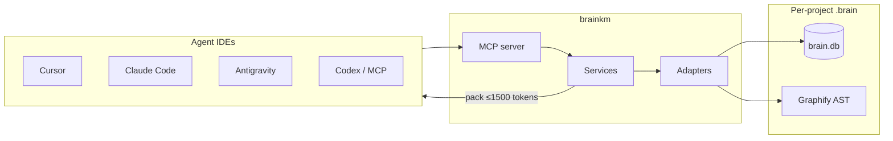

<div align="center">


# MemNetwork

**Local project memory for agentic coding IDEs.**

One SQLite brain. Six MCP tools. Bounded context packs.  
Survive chat compaction — share memory across Cursor, Antigravity, Claude Code, and Codex.

[](brainkm/pyproject.toml)
[](brainkm/pyproject.toml)
[](LICENSE)
[](docs/FEATURES.md)
[](docs/BENCHMARKS.md)
[](docs/benchmarks/2026-07-21-footprint.md)

<br/>

[](docs/install/cursor.md)
[](docs/install/antigravity.md)
[](docs/install/claude-code.md)
[](docs/install/codex.md)
[](docs/install/generic.md)

<br/>

[Visual Tour](#visual-tour) · [Results](#results) · [Quick Start](#quick-start) · [Features](#features) · [How it works](#how-it-works) · [Docs](#documentation)

</div>

---

## Why MemNetwork

Agents burn tokens re-reading files and lose decisions when chat compacts. Host Memories help — but they are not a searchable, graph-aware **project brain**.

| | |
|---|---|
| **Stop re-explaining pivots** | “We chose JWT over sessions” lives in SQLite neurons, not only in chat history. |
| **Cut token dumps** | Bounded `context_pack` (≤1,500 tokens) vs naive multi-file dumps (**no agent tool loop**) — **95.2%** avg in live pack-vs-dump tests. |
| **Survive compaction** | PreCompact handover + SessionEnd distill keep truth in `.brain/brain.db`. |
| **One brain, many hosts** | Same local store across Cursor, Antigravity, Claude Code, Codex, and any MCP client (~55–70 MB idle). |

Not a Cursor plugin. Not a second `@codebase`. Cursor locates symbols; MemNetwork remembers *why* and maps *how code connects*.

---

## Visual Tour

<div align="center">

| `brainkm configure` | Host setup wizard |
|---------------------|-------------------|
|  |  |
| *Live status, graph health, review queue* | *One-click MCP + hooks for each IDE* |

| `brainkm viz` — Neural Cosmos | Blast-radius inspector |
|-------------------------------|-------------------------|
|  |  |
| *AST + memory graph in the browser* | *Calls, imports, downstream impact* |

</div>

---

## Results

**Pack-vs-dump** (naive multi-file context load vs `context_pack` — **not** a full-agent run with Grep/Read/edit tools):

| Scenario | Without brain (full file dump) | With `brainkm` | Savings |
|----------|--------------------------------|----------------|---------|
| AST class & handler lookup | 20,293 tok | **733** | **96.4%** (27.7×) |
| Hook & distill pipeline | 20,293 tok | **1,084** | **94.7%** (18.7×) |
| MCP / config query | 20,293 tok | **1,132** | **94.4%** (17.9×) |
| **Average** | **20,293** | **~983** | **95.2%** (21.4×) |

Same method on the Cursor-framed `compare` suite averages **~94%**. Full-agent A/B (Cursor / Antigravity with in-built tools) is deferred until both hosts are measured the same way.

Every pack stays under the hard **1,500-token** cap. Typical latency: **~13–18 ms**. Idle shared server: **~55–70 MB RAM**.

Full scorecard → [docs/BENCHMARKS.md](docs/BENCHMARKS.md) · pack-vs-dump method → [live run](docs/benchmarks/2026-07-21-antigravity-live.md) · [footprint](docs/benchmarks/2026-07-21-footprint.md)

---

## Quick Start

**Prerequisites:** Python 3.11 or 3.12.

### 1. Clone and install

```bash
git clone https://github.com/noyal1234/MemNetwork.git
cd MemNetwork

bash brainkm/scripts/setup_dev.sh
source .venv/bin/activate
```

### 2. Configure your IDE(s)

**Recommended** — guided TUI:

```bash
pip install -e "./brainkm[tui]"
brainkm configure
```

- **One IDE** → silent memory; that host starts the brain for you.
- **Two or more** → shared localhost brain; use **Start Brain** once from the TUI.

**Without TUI** — core CLI:

```bash
brainkm install --dev --client cursor   # or claude | antigravity | codex | generic
brainkm graph sync                      # optional first code graph
brainkm doctor
```

### 3. Reload MCP and explore

Restart the IDE (or reload MCP servers), then optionally:

```bash
brainkm viz       # browser graph explorer
brainkm version   # expect 0.8.2
```

Full setup → [docs/INSTALL.md](docs/INSTALL.md) · per host → [Cursor](docs/install/cursor.md) · [Antigravity](docs/install/antigravity.md) · [Claude](docs/install/claude-code.md) · [Codex](docs/install/codex.md)

---

## Features

- **Compaction survival** — SessionStart injection, PreCompact handover, SessionEnd distill (manual: `brainkm handover` / `capture`)
- **Code graph** — Graphify AST; `traverse` for blast-radius; `context_pack` for task neighborhoods; auto-sync after Write/Edit
- **Smart retrieval** — Zero-LLM default (FTS5 BM25 + weighted PPR); optional MiniLM via `[semantic]`; abstain on low confidence
- **Pin / correct only** — Hooks + `auto_observe` fill the brain; MCP `remember` is pin, correct, or archive — not everyday notes
- **Local-first privacy** — Secrets redacted on write and before injection; brain stays on disk

Catalog → [docs/FEATURES.md](docs/FEATURES.md)

---

## How it works



| Layer | Role |
|-------|------|
| **Memory** | SQLite FTS5 neurons — decisions, rules, facts, errors |
| **Code graph** | Graphify AST neighbors for `traverse` / packs |
| **MCP** | stdio or localhost HTTP — **6** agent-facing tools |
| **CLI / TUI** | Typer core; Textual `configure` when `[tui]` is installed |

**Layering:** MCP tool → service → adapter → SQLite. Deep dive → [docs/AI_PROJECT_BRIEF.md](docs/AI_PROJECT_BRIEF.md)

### MCP tools

| Tool | Use when |
|------|----------|
| **`recall`** | “Why did we choose X?” |
| **`context_pack`** | Task context across 3+ files (then verify in source) |
| **`traverse`** | “What calls / imports X?” / blast-radius |
| **`trace_changes`** | “What changed in this file recently and why?” |
| **`remember`** | Pin, correct, or archive a decision |
| **`brain_stats`** | Graph empty? Brain health? |

<details>
<summary><strong>Tool routing matrix</strong></summary>

| Question | Use first |
|----------|-----------|
| Where is symbol X defined? | Host codebase index / Grep |
| Why did we choose X over Y? | **`recall`** |
| What calls / imports X? | **`traverse`** |
| What changed in this file recently / why? | **`trace_changes`** |
| Understand one module (3+ files) | **`context_pack`**, then verify in source |
| Pin a decision / fix bad memory | **`remember`** |
| Cross-project prefs / static policy | Host Memories / rules — not brainkm |

</details>

### Supported hosts

| Host | Adapter highlights | Guide |
|------|--------------------|-------|
| **Cursor** | `.cursor/` — PreCompact + SessionEnd | [install/cursor.md](docs/install/cursor.md) |
| **Google Antigravity** | `.agents/` (`serverUrl`) — Stop → project `.brain/` | [install/antigravity.md](docs/install/antigravity.md) |
| **Claude Code** | `.claude/settings.json` + `.mcp.json` — Subagent/PostCompact | [install/claude-code.md](docs/install/claude-code.md) |
| **OpenAI Codex** | `.codex/config.toml` + `/hooks` trust — Stop → session-end | [install/codex.md](docs/install/codex.md) |
| **Generic MCP** | stdio / HTTP — manual `capture` / `handover` | [install/generic.md](docs/install/generic.md) |

---

## Documentation

| Doc | Contents |
|-----|----------|
| [FEATURES.md](docs/FEATURES.md) | Feature catalog + tool definitions |
| [INSTALL.md](docs/INSTALL.md) | Clone + multi-client overview |
| [install/](docs/install/) | Per-host wiring (Cursor / AGY / Claude / Codex / generic) |
| [AI_PROJECT_BRIEF.md](docs/AI_PROJECT_BRIEF.md) | Architecture + MCP contract |
| [BENCHMARKS.md](docs/BENCHMARKS.md) | CMA scorecard + eval targets |
| [CLI_COMMANDS.md](docs/CLI_COMMANDS.md) | CLI reference |
| [SECURITY.md](docs/SECURITY.md) | Redaction posture |
| [AGENTS.md](AGENTS.md) | Agent entry point |
| [brainkm/README.md](brainkm/README.md) | Package / development notes |

---

## Status

**brainkm 0.8.2** — six MCP tools, first-class Cursor / Claude / Antigravity / Codex hosts, per-host install guides, git commit↔session joins, shared HTTP hardening, included `brainkm viz`.

- [x] Local SQLite brain + **6** MCP tools
- [x] Cursor / Claude / Antigravity / Codex adapters
- [x] Compaction survival (PreCompact + SessionEnd)
- [x] Pack-vs-dump token benchmarks (**95.2%** live / **~94%** `compare`; full-agent A/B deferred)
- [x] Shared HTTP MCP Bearer auth + loopback guards
- [x] Browser graph explorer (`brainkm viz`) + optional TUI (`brainkm configure`)
- [ ] PyPI / `uvx` one-liner (deferred — public release)
- [ ] MCP Registry / host one-click installers (deferred)

---

## Contributing

See [CONTRIBUTING.md](CONTRIBUTING.md). Contributions require agreeing to the [CLA](CLA.md).

---

## License

Apache License 2.0 — see [LICENSE](LICENSE) and [NOTICE](NOTICE).  
Copyright © 2026 Noyal Bastin Benny.

<p align="right"><a href="#memnetwork">Back to top</a></p>
