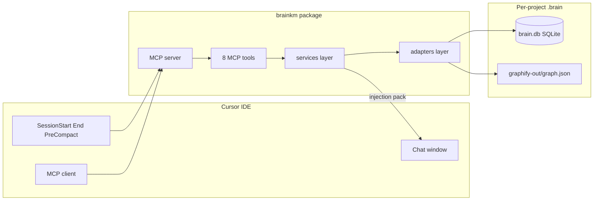
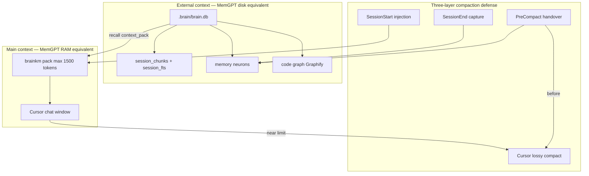

# MemNetwork (brainkm) — AI Project Brief

> **Purpose:** Single source of truth for what MemNetwork is, how it is built, and what to implement next.  
> **Repo:** `MemNetwork/` — Python package `brainkm` (MCP server + CLI).  
> **MCP server name:** `brainkm` · **Storage:** `.brain/brain.db` per target project.  
> **User-facing feature catalog:** [FEATURES.md](FEATURES.md)

---

## 1. Product vision

**MemNetwork** is a **local, project-scoped augmented brain** for Cursor, Claude Code, Antigravity, and OpenAI Codex CLI. It captures architectural decisions from chat and plans, maps code structure via an AST graph, and injects bounded context so agents stop re-reading files and re-explaining past decisions.

| Principle | Meaning |
|-----------|---------|
| **Zero-LLM default (T0)** | Rule-based distill, FTS5 BM25, Graphify AST — no local Ollama, no cloud API required |
| **User-chosen distill** | `capture.distill_mode`: `cursor` \| `claude` \| `antigravity` \| `codex` \| `ollama` \| `groq` \| `rules` (legacy `mcp` → `claude`) |
| **Compaction-aware** | PreCompact / synthetic-precompact handover + SessionEnd / idle Stop so truth survives host compaction |
| **Inspectable** | Every memory is a SQLite row or markdown export — `remember action=archive`, export/import, consolidate |
| **Bounded tokens** | 1500-token hard cap on agent-facing packs (`pack_text` + compact MCP JSON); structural retrieval over file dumps |
| **Complement Cursor** | Does not replace @codebase or Cursor Memories — stores **project-specific** decisions |

**Primary jobs:**

1. Remember why we chose X over Y (decisions, pivots, plan changes).
2. Navigate code structure without re-reading entire modules (`context_pack`, `traverse`).
3. Survive long sessions and compaction with external recall storage.
4. Self-learn useful tool chains as procedure nodes (V2).

---

## 2. System context



| Layer | Technology | Role |
|-------|------------|------|
| **Memory** | SQLite FTS5 BM25 | Neurons (`kind=memory`) — facts, decisions, rules |
| **Code graph** | Graphify AST adapter | `code` nodes, import/call edges |
| **Temporal** | `valid_from` / `valid_until`, `supersedes` | Evolving facts without full GraphRAG |
| **MCP** | `mcp` SDK stdio **or** localhost HTTP (`brainkm serve`) | 8 tools: remember (pin/correct/archive), recall (+decision trail), context_pack (self-healing), traverse (impact), brain_stats, trace_changes (live git + joins), feedback (explicit used/wrong signal), checkpoint (forced handover for hosts without native PreCompact) |
| **CLI** | Typer | install, serve, connect, doctor, export, bench, repair, handover, review, hygiene, procedures, migrate, configure, git-note, trace |
| **TUI** | Textual (optional `[tui]` extra) | `brainkm configure` — guided app checkboxes, Start Brain, dashboard, config editor, actions |
| **Optional T1** | sqlite-vec + ONNX MiniLM | Semantic search when `semantic: true` |
| **Optional T2** | Host / Ollama / Groq at SessionEnd | `distill_mode: cursor \| claude \| antigravity \| codex \| ollama \| groq` |

---

## 3. Repo layout

```
MemNetwork/
├── .venv/                         # Python venv (gitignored)
├── AGENTS.md                      # Agent entry point
├── docs/
│   ├── AI_PROJECT_BRIEF.md        # This file
│   ├── CLI_COMMANDS.md            # Full CLI catalog
│   ├── INSTALL.md                 # Clone + multi-host overview
│   ├── install/                   # Per-host guides (cursor, antigravity, …)
│   ├── research/                  # Design notes (e.g. TOKEN_COMPRESSION.md)
│   └── TUI_APP_PLAN.md            # brainkm configure (shipped)
├── .cursor/
│   ├── skills/memnetwork-backend/
│   └── rules/memnetwork-*.mdc
├── brainkm/
│   ├── pyproject.toml             # Source of truth for deps
│   ├── scripts/setup_dev.sh
│   ├── brainkm/
│   │   ├── cli.py                 # Typer CLI
│   │   ├── config.py              # get_settings()
│   │   ├── logging_config.py
│   │   ├── models/
│   │   │   ├── brain_config.py    # .brain/config.json schema
│   │   │   └── schemas.py         # MCP tool I/O
│   │   ├── tools/                 # MCP handlers
│   │   ├── services/              # memory, search, budget, learning, …
│   │   ├── adapters/              # graphify, transcripts, distill, redaction
│   │   ├── tui/                   # Textual configure app (optional [tui])
│   │   └── db/                    # SQLite + migrations
│   └── tests/
└── README.md
```

**Per target project** (after `brainkm install`):

```
.brain/
├── brain.db              # gitignore
├── config.json           # optional commit
├── graphify-out/
└── exports/
```

---

## 4. MCP tool contract (V1 / current)

**Package version:** `0.9.0`

| Tool | Purpose |
|------|---------|
| `remember` | **Pin** / **correct** / **archive** (`action`). Correct writes a `supersedes` edge; archive soft-deletes (absorbs former `forget`). Hooks remain the primary capture path; auto-links path/symbol mentions |
| `recall` | FTS5 + graph activation; abstain on low confidence (percentile default P10); returns `confidence` + optional `decision_trail` (supersede history for why/history intents) |
| `context_pack` | Task-specific compiled pack (graph + neurons + procedures + decision history). Prefer before 3+ file reads; for pure blast-radius use `traverse`. Auto-queues graph refresh when stale. Lean MCP payload by default (`include_structured=true` for arrays) |
| `traverse` | **Impact analysis**: AST neighborhood + `impact_summary` (hop counts, high fan-in risk) + linked decision/error neurons. Defaults: `direction=both`, structural edges |
| `brain_stats` | Health summary: neuron/graph counts, MCP usage (7d), abstention rate, dead-neuron count, `hygiene_hint`, `compression` rollups; optional `session_id` adds per-session fields |
| `trace_changes` | **Change history**: live `git log --follow` + uncommitted `git diff` for a path, joined to commit nodes from `brainkm git-note` (sha→session→decisions). Diffs are not ingested |
| `feedback` | Explicit `signal=used\|not_used\|wrong` on node ids from a prior `recall` / `context_pack` / `traverse` (agent-corrected learning signal; migration `012_tool_feedback`) |
| `checkpoint` | Force a handover distill now for hosts without native PreCompact (Antigravity / generic MCP). Cursor / Claude / Codex already get PreCompact hooks |

Removed from MCP (still available via CLI/hooks/services): `session_status`, `forget` → `remember action=archive`, `graph_sync` → auto-queue on stale reads + `brainkm graph sync`.

CLI-only (not MCP): `install`, `serve`, `connect`, `doctor`, `export`, `bench`, `repair` (`--backfill-links`, `--backfill-supersedes`), `handover`, `review`, `hygiene`, `procedures`, `migrate`, `configure`, `git-note`, `trace`.

Shared localhost brain: prefer **`brainkm configure`** (multi-app → Start Brain). Power path: `brainkm serve` + `brainkm connect <client> --http` so Cursor / Claude / Antigravity / Codex share one HTTP MCP process and `.brain/brain.db`. Antigravity HTTP MCP uses `serverUrl`. Codex MCP lives in `.codex/config.toml` (`[mcp_servers.brainkm]`); trust the project layer and `/hooks`. Hooks remain the primary memory writers (`capture.auto_observe`).

---

## 5. Host ecosystem boundaries

MemNetwork **complements** Cursor, Claude Code, and Antigravity — it does not replace built-in indexing, user memories, or static rules. One `brainkm` MCP server per project; do not stack Mem0, Pinecone, or other memory layers on top.

| Client | MCP path | Hooks / rules |
|--------|----------|---------------|
| Cursor | `.cursor/mcp.json` | `.cursor/hooks.json`, `.cursor/rules/brainkm.mdc` |
| Claude Code | `.mcp.json` | `.claude/settings.json`, `.claude/rules/` |
| Antigravity | `.agents/mcp_config.json` (HTTP: **`serverUrl`**) | `.agents/hooks.json`, `.agents/rules/` |
| Codex CLI | `.codex/config.toml` `[mcp_servers.brainkm]` | `.codex/hooks.json`, `AGENTS.md`, `.codex/skills/` |

### 5.1 System boundaries

| System | Scope | What it stores | brainkm rule |
|--------|-------|----------------|--------------|
| **Cursor Memories** | Cross-project user preferences | "I prefer tabs over spaces", global coding style | **Do not duplicate.** brainkm stores **this project's** decisions, rules, and pivots only |
| **Cursor Rules** (`.cursor/rules/`) | Static team policy | Always-on conventions, lint rules, architecture mandates | **Complement.** Rules = policy; neurons = dynamic learned context. `brainkm install` scans rules and warns on topic overlap |
| **@codebase** | Semantic code index (embeddings) | Source files, symbols, natural-language code search | **Complement, not replace.** Consult `context_pack` / `traverse` first for navigation, **then verify in source** before editing |
| **Chat compaction** | Lossy in-window summarize (~35% DMR recall) | Compressed chat history inside the window | **Work with it.** PreCompact handover + SessionEnd capture → neurons survive in `brain.db` |
| **Agent transcripts** | Raw JSONL chat history | Full conversation logs under `agent-transcripts/` | **Distill, don't inject.** Search via `session_fts`; auto-distill to neurons at SessionEnd/PreCompact |

### 5.2 @codebase vs brainkm — when to use which

| Question type | Use first | Why |
|---------------|-----------|-----|
| "Where is auth middleware defined?" | **@codebase** or `context_pack` | Semantic/symbol lookup across source |
| "Why did we choose JWT over session cookies?" | **`recall`** | Decision lives in chat/plan distill, not in code index |
| "What connects `AuthService` to `UserRepo`?" | **`traverse`** | Focused AST neighborhood (callers/callees/imports) |
| "What changed in `auth.py` recently and why?" | **`trace_changes`** | Live git timeline + brain commit joins |
| "What failed last time we touched payments?" | **`recall`** (subtype `error`) | Known failure modes are neurons |
| Read 5+ files to understand one module | **`context_pack`** then targeted reads | Bounded pack vs multi-file dumps; never skip reading source you will change |

**Do not** wire local LLM into `recall` or `context_pack` to compete with @codebase — that duplicates Cursor's index badly and destroys the token-efficiency story.

### 5.3 Frozen snapshot vs live recall

Injection (SessionStart hook) and tool calls (MCP) use **different data paths** on purpose:

| Path | Data source | Updates mid-session? |
|------|-------------|----------------------|
| SessionStart injected pack | Frozen snapshot (`session_snapshots`) | **No** — preserves Cursor prefix cache |
| Agent calls `recall` | Live `brain.db` | Always fresh |
| Agent calls `context_pack` | Live `brain.db` | Always fresh |
| Agent calls `remember` | Writes live DB | Visible to next `recall` in same session; **not** added to frozen pack |

Controlled by `injection.frozen_snapshot: true` (default). PostCompact snapshot refresh is **V1.5**.

### 5.4 What MemNetwork wins on (vs @codebase alone)

- **Decision/pivot memory** — "why X not Y" from chat and plans
- **Bounded `context_pack`** — path-labeled snippets under the 1500-token agent-facing cap (vs multi-file reads)
- **Cross-session chat distill** — survives compaction via PreCompact handover
- **Procedure learning** (V2) — promote repeated co-activated context + observed tool sequences into `kind=procedure` stubs (scaffolding; not Hermes-grade skill self-improvement)

---

## 6. Related memory systems (MemGPT / Mem0 / Claude)

MemNetwork implements **MemGPT-style virtual context** without LLM self-paging — hooks and deterministic retrieval replace agent-managed memory paging.



### 6.1 MemGPT mapping ([arXiv:2310.08560](https://arxiv.org/abs/2310.08560))

| MemGPT tier | MemNetwork equivalent | Paging controlled by |
|-------------|----------------------|---------------------|
| Main context | Cursor chat + injected pack (≤1500 tokens) | Hooks + budget — **not LLM** |
| Recall storage | `session_chunks` + `session_fts` | SessionEnd + PreCompact capture |
| Archival storage | `nodes` where `kind=memory` | Hooks + distill primary; MCP `remember` for pin/correct |
| Self-editing memory | `supersedes` edges, co-activation (V2), pin via `remember` | Hooks + learning loop + agent corrections |

**Adopt:** External store beats recursive summarization — DMR benchmark ~**93.4%** recall vs ~**35.3%** for lossy summarize.

**Reject:** LLM-managed paging (MemGPT/Letta) — every page-in is an LLM call; incompatible with zero-LLM default and token budget.

### 6.2 Mem0 mapping ([arXiv:2504.19413](https://arxiv.org/abs/2504.19413))

| Mem0 pattern | MemNetwork | Phase |
|--------------|------------|-------|
| Multi-signal fusion (vector + BM25 + entity) | FTS5 BM25 + 2-hop graph activation + optional sqlite-vec RRF | V1 / T1 |
| Session decomposition | Split transcripts into user/assistant rounds before distill | V1 |
| Fact-augmented keys | Auto-tags on distill for BM25 indexing | V1 |
| ADD-only audit trail | `audit_log`; `remember action=archive` / `forget_neuron` → `valid_until` (soft archive) | V1 |
| Async extraction | SessionEnd / PreCompact run after agent responds | V1 |
| ADD-only without supersede | **Reject** — use `supersedes` for knowledge updates (LongMemEval) | — |

**Reject:** Hosted Mem0 API — one local MCP server only; no cloud vector layer.

### 6.3 Claude / Cursor compaction mapping

| Claude / Cursor primitive | MemNetwork equivalent |
|-------------------------|----------------------|
| Compaction (lossy summarize) | Work **with** it — PreCompact `brainkm handover` captures before loss |
| Tool-result clearing | `context_pack` delivers smallest verifiable pack upfront |
| Built-in memory tool | `brain.db` neurons + hooks / `recall` (+ `remember` pin) |
| Post-compact amnesia | SessionStart frozen injection + live `recall` on demand |

**Three-layer defense:** (1) SessionEnd continuous capture → (2) PreCompact handover → (3) SessionStart injection after compact.

### 6.4 System comparison

| System | Infra | LLM per memory op | Compaction strategy | Best for |
|--------|-------|-------------------|---------------------|----------|
| MemGPT/Letta | Server + vector DB | Yes (self-paging) | LLM-managed | Hosted research agents |
| Mem0 | Cloud vector + graph | Yes (async extract) | None (external only) | SaaS memory layer |
| Zep/Graphiti | Neo4j / cloud | Yes per episode | Temporal KG | Enterprise multi-tenant |
| Claude/Cursor compact | Built into IDE | Yes (summarize) | Lossy in-window | Session survival only |
| **MemNetwork** | SQLite local | **cursor \| ollama \| groq \| rules** at SessionEnd/PreCompact only | **PreCompact + SessionEnd + injection** | Solo dev project brain |

### 6.5 Research patterns — adopt vs defer

| Paper / system | Key insight | MemNetwork stance |
|----------------|-------------|-------------------|
| MemGPT DMR | External recall >> summarize | **Adopt** metaphor + DMR-lite bench (V1.5) |
| Mem0 fusion | Multi-signal retrieval | **Adopt** FTS5 + graph; optional vectors (T1) |
| STAR-RAG | Seeded PPR, high token reduction | **Adopt** tag-graph 2-hop BFS (lighter than full PPR) |
| Zep/Graphiti bi-temporal KG | Episode + semantic layers | **Defer** — patterns only; too heavy for default |
| LongMemEval | Temporal knowledge updates | **Adopt** `supersedes`, not pure ADD-only |

**Rejected for V1–V3 default:** Neo4j, Pinecone, Mem0 cloud, MemGPT LLM self-paging, full temporal GraphRAG, Postgres.

---

## 7. BrainConfig (`.brain/config.json`)

Validated by `BrainConfig` in `brainkm/models/brain_config.py`. Example: `brainkm/config.example.json`.

Key fields:

- `project_roots` — monorepo roots the brain spans
- `budget.total_tokens` — default 1500 (enforced on `pack_text` and lean MCP payload; structured duplicates are opt-in)
- `capture.plan_files` — ingest `.cursor/plans/*.plan.md`
- `capture.distill_mode` — `rules` \| `cursor` \| `claude` \| `antigravity` \| `codex` \| `ollama` \| `groq` (see local vs cloud note below)
- `ollama.model` — default `qwen2.5:3b`; optional `auto_select_model` via `brainkm ollama doctor`
- `groq.model` — default `llama-3.3-70b-versatile`; API key via `GROQ_API_KEY` env / `.env`
- `injection.frozen_snapshot` — SessionStart pack frozen; mid-session `remember` does not mutate injection
- `injection.max_recalls_per_turn` — default **3** (30s window)
- `recall.abstain_mode` / `recall.abstain_percentile` — return `[]` on low-confidence matches (default percentile **0.10** / P10; least-strict of live/rolling/calibration thresholds)
- `handover.precompact_enabled` — PreCompact hook distill
- `handover.precompact_distill_timeout_seconds` — default **30** (avoids silent fall-through to noisy `rules` during handover)

### Local vs cloud distill

`capture.distill_mode` selects the **extractor backend** for the whole project (every IDE shares it). Transcript format detection stays per-host. Mode names `cursor` / `claude` / `antigravity` / `codex` mean “use that CLI (or heuristics) as the LLM,” not “only distill that host’s files.”

| Mode | When to choose | Requirements |
|------|----------------|--------------|
| `rules` | Zero-dependency default; offline; no API key | None |
| `ollama` | Privacy / offline LLM distill on your machine | Ollama daemon + model (`brainkm ollama doctor`) |
| `groq` | Higher quality / speed without local GPU/CPU load (good shared default across IDEs) | `GROQ_API_KEY` in project `.env` or env + network + `capture.cloud_distill_acknowledged: true` (`brainkm groq doctor`) |
| `cursor` | Cursor agent CLI (`agent -p`) when available; else Cursor-aware heuristic distill of cleaned transcripts | Cursor session hooks; optional `agent` CLI |
| `claude` | Claude Code peer distill | `claude` on PATH (or live MCP sampling) |
| `antigravity` | Antigravity peer distill (`agy -p`) | `agy` on PATH |
| `codex` | Codex CLI peer distill (`codex exec`, read-only / unattended) | `codex` on PATH |

T0 remains **rules** — cloud and local LLM distill are opt-in. Never put API keys in `.brain/config.json` or neurons. Groq refuses upload until `cloud_distill_acknowledged` is set (wizard sets it when you pick groq).

All distill modes share Cursor chrome cleaning (`clean_cursor_text` / `is_distill_noise`) before extraction. LLM modes return `{"neurons":[...]}`; subtypes are validated in code. Capture fingerprints title+body to skip duplicates; SessionStart/PreTool injection re-runs a noise gate so junk never reaches the agent.

### Security notes (local threat model)

- **Neuron / chunk writes** go through `adapters/redaction.py` (secrets + prompt-injection regexes). Injection filters are defense-in-depth only — recalled memories remain untrusted agent input.
- **HTTP MCP** (`brainkm serve`): loopback bind by default; Bearer token in `.brain/mcp_http_token`; non-loopback requires `--allow-remote` / `mcp.allow_remote`.
- **Viz** serves APIs with a per-process `?token=` (and HttpOnly cookie); no wildcard CORS.
- **Graphify** `extract_extra_args` is allowlisted; code-graph import skips redaction-blocked nodes.

---

## 8. Implementation status

| Phase | Status | Deliverables |
|-------|--------|--------------|
| **V0** | Done | Scaffold, AGENTS.md, BrainConfig, tests, cursor rules |
| **V1** | Done | SQLite brain, hooks, install, capture/handover, Graphify import + sync, frozen snapshot, MCP tools, adaptive abstention |
| **V1.5** | Done | bench suites, repair + abstention recalibrate, export/import merge, PostCompact refresh |
| **V2** | Done | Tool registry, review queue, confidence-gated review, PostToolUse learning loop, session-scoped co-activation procedure promotion (tool-sequence body + context seeds) |
| **TUI** | Done | `brainkm configure` Textual app (guided multi-app wizard, Start Brain, dashboard, config editor, actions); optional `[tui]` extra — see [TUI_APP_PLAN.md](TUI_APP_PLAN.md) |
| **0.2.0** | Done | End-to-end token cap on agent-facing packs; lean MCP payloads; MCP usage telemetry in `brain_stats`; distill cleaning parity + prompt fix; `brainkm hygiene`; injection-time noise gate; path-labeled code nodes |
| **0.3.0** | Done | Redaction on all neuron write paths; SessionStart/snapshot total_tokens clamp; read-tool commits via WriteQueue; session-scoped `brain_stats`; TUI SVG snapshots + ANSI-16 fallback; version discipline; hybrid RRF retrieval + PPR; intent routing; conflict supersede; pack compression/summary-first; latency bench; usage feedback; decay/consolidate; multi-client install; MCP resources/HTTP; team neurons; import `--replace` |
| **0.3.1** | Done | TUI wizard **Agent Client** step (`cursor` / `claude` / `generic`) wired to `run_install(--client)`; Cursor Agent CLI step gated on client+distill; docs/skill/CLI/TUI plan version sync |
| **0.3.2** | Done | Real ONNX MiniLM + CE rerank (opt-in `[semantic]`); wizard **Semantic Quality** consent after Hardware Doctor; typed MCP `outputSchema`; Claude JSONL capture; MCP sampling callback hook; TUI knobs for semantic/rerank/decay; BENCHMARKS local latency numbers |
| **0.4.0** | Done | Shared localhost brain: `serve` / `connect` / `doctor`, URL MCP, `/health`, TUI app checkboxes + Start Brain; Claude `.mcp.json` + Codex adapter; `capture.auto_observe` (PostToolUse / prompts / failures → capped observations → SessionEnd promote); `remember` demoted to pin/correct in rules/docs |
| **Nodal adopt** | Done | Lifecycle ladder (observation TTL, episode, `distilled_from`); `about_file`/`about_symbol` + hook file seeds; concept materializer; Seed→Expand→Diversify→Budget→Abstain; pack quotas; `consolidate --llm`; temporal supersede meta; team tags; skill pack; scorecard bench; `file-history` / `provenance` / `demo` CLI |
| **0.4.1** | Done | Claude Code silent memory parity: `.claude/settings.json` hooks + `hookSpecificOutput`; SubagentStart/Stop + Stop; Claude-default `auto_observe`; `.claude/rules` + routing skill; doctor dry-run; TUI copy/dashboard Claude hooks status; coexistence with CLAUDE.md / Auto Memory |
| **0.4.2** | Done | Antigravity first-class client (`.agents/` MCP `serverUrl` + named hooks, PreInvocation inject, synthetic precompact, idle Stop distill, AGY transcript JSONL); `distill_mode` peers `claude` (`claude -p` + live sampling) + `antigravity` (`agy -p`); legacy `mcp`→`claude`; TUI Antigravity checkbox + dashboard AGY hooks; doctor multi-path probes + `--mirror-global` |
| **0.5.0** | Done | Shared-brain security + ops polish: HTTP MCP loopback guard + Bearer token (`.brain/mcp_http_token`, `connect` headers); viz per-run `?token=` / no wildcard CORS; expanded redaction; Groq `cloud_distill_acknowledged`; graphify `extract_extra_args` allowlist + graph-import sanitize; TUI MCP Doctor panel + Review Queue (`y`/`n`) + brain-status sidebar; client routing skill / hook parity |
| **0.6.0** | Done | Unified-brain MCP surface 8→5 (drop `session_status`/`forget`/`graph_sync` from MCP); `remember` pin/correct/archive; `recall` decision_trail + confidence; `traverse` impact_summary + linked neurons; shared token budget for overlays; corpus-aware abstention floor; self-healing stale-graph queue; about_*/supersedes backfill (`repair --backfill-*`, `--dry-run-supersedes`); viz `base_url`/`token` handle fields |
| **0.7.0** | Done | Git change trace: MCP `trace_changes` + CLI `git-note`/`trace`; live git log/diff joins (no diff ingest); post-commit hook via `git.commit_trace` (new brains on, grandfather Off); merge/empty skip; commit retention hygiene; husky/`core.hooksPath` skip+warn; TUI Git section + dashboard Commit Trace status |
| **0.8.0** | Done | Codex CLI first-class client: `.codex/config.toml` `[mcp_servers.brainkm]` (stdio/HTTP + `http_headers`), PascalCase nested hooks (Stop → session-end), Codex stdout envelopes, fail-soft, rollout JSONL capture, `distill_mode=codex` via `codex exec` (rules fallback), AGENTS.md + skill, doctor trust/`/hooks` notes; `tomlkit` dep |
| **0.8.1** | Done | Antigravity Stop → project brain: hooks bake `--project-dir`; resolve root from `workspacePaths` / parent of `.agents` cwd; load project `.env` for `GROQ_API_KEY`; PreInvocation/doctor/connect auto-heal missing `--project-dir` + remove shadow `.agents/.brain` (merge `agy_sessions.json`); docs clarify distill mode = extractor (not transcript parser) |
| **0.8.2** | Done | README badge fixes (token reduction → BENCHMARKS.md; host badges → per-IDE guides); new `docs/install/{cursor,antigravity,claude-code,codex,generic}.md` exclusivity pages; INSTALL index + version lockstep |
| **0.8.5** | Done | Content-class token compression pipeline (classify → protect → rtk_lite/prose → session dedup → inflation_guard); dual-store/canary engine versions + migration `009_compression`; `brain_stats.compression` rollups; optional `[compression]` LLMLingua-2 (off by default); optional terse-agent skills; research note [TOKEN_COMPRESSION.md](research/TOKEN_COMPRESSION.md) |
| **0.8.6** | Done | macOS CLI heal: launcher clears `UF_HIDDEN` on `.venv` `*.pth`, writes `.brain/cli_health.json`, SessionStart one-shot notice + `doctor` warnings (`repair_venv.sh` still the hard fix); PreToolUse Shell/Bash packs restored with path/symbol seed filter; pack hits from `truncation.included_ids` (memory+procedure); debug/recall routing (`direct_match_boost`, stronger DEBUG intent, MCP/hook copy to recall failures before hand-debugging) |
| **0.9.0** | Done | Learning-loop close: MCP `feedback` + `checkpoint` (migration `012_tool_feedback`); session-scoped procedure promotion with ordered tool-chain payloads + `brainkm procedures list\|archive`; WriteQueue resurrects dead/cross-loop workers so CLI `run_blocking` no longer hangs after async MCP; Claude PreToolUse matcher includes Bash (template↔builder parity); TUI shared-brain dashboard snapshots refreshed; docs/README MCP contract synced to **8** tools |
| **Hebbian learning** | Done | Episode-gated co-activation (one saturating bump per capped `persist_neuron_hits` episode; ambient snapshots never open pairwise); `BEGIN IMMEDIATE` CAS consume; compound idle decay via `decayed_at` checkpoint (migration `010_learning_hebbian` + legacy weight clamp); ignore-eligible inject only from targeted hits with atomic per-session dedupe; sample-gated promote/archive + ignore half-life; SessionEnd drops unconsumed episodes |
| **Outbound trust** | Done | Shared outbound injection/noise gate on recall + pack procedures + traverse linked memories **and ambiguity candidate labels**; BM25-gated procedures + retrieval-strength pack confidence; git subject/diff sanitize + pathspec/symlink containment (`shell=False`); ambiguous `traverse` abstain + candidates; MCP `remember` enums (legacy non-enum rows still readable); joint 50/50 structured budget after pack_text; traverse `session_id` + unresolved/ambiguous telemetry; outbound_gate_7d + traverse_abstain_7d on `brain_stats`. **Residual:** store≠inject threat model reuse; procedure BM25 floor uncalibrated; obfuscation/encoding bypasses; author/email not in pack (only ISO date); no multi-tenant isolation claim; MCP latency of extra FTS+sanitize not budgeted. **Chocolate-cake:** unrelated popular procedure injected into off-topic pack with medium confidence from density — fixed by BM25 gate + BM25 confidence. |
| **CMA scorecard** | Done | Headline **recall@budget** (gold-in-pack ≤1500): CMA **0.833**, LME-S full-500 **0.892** @ 373 tok; CMA micro **100%** is a regression gate; LME dual-grain fts-blob R@5 **0.934**; `run_cma.sh` + dated `docs/benchmarks/` artifacts |
| **End-task A/B** | Done | Harness `brainkm/scripts/endtask_harness.py` + fixture `endtask_v1` (12 knowledge / 8 change); dry-run smoke artifact; live claim needs `CURSOR_API_KEY` + `--repeats 3` |
| **License** | Done | Apache-2.0 ([LICENSE](../LICENSE), [NOTICE](../NOTICE)); copyright Noyal Bastin Benny; [CLA](../CLA.md) + [CONTRIBUTING](../CONTRIBUTING.md) for future relicense option |
| **Public distribution** | **Deferred** | PyPI / `uvx` one-liner, MCP Registry, Cursor deeplink — wait until repo is public, installable name is finalized (may rename from `brainkm`), and a stable version ships. Trusted-publishing workflow prepared under `.github/workflows/publish.yml`. Local path: `brainkm install --dev`. See [PUBLIC_RELEASE_CHECKLIST.md](PUBLIC_RELEASE_CHECKLIST.md). |
| **Client uninstall** | **Deferred** | `brainkm uninstall --client <name>` to remove brainkm MCP/hooks/rules entries from `.cursor/`, `.claude/`, `.agents/`, `.codex/`, `.mcp.json` without wiping user content. Install/connect currently merge-only. |
| **V3+ polish** | Ongoing | Packaged ONNX MiniLM weights, cross-encoder reranker weights, refreshed public bench numbers after open-source |

### SQLite concurrency

Single-writer queue (`services/write_queue.py`) serializes MCP writes (remember, use_count flush, feedback) with SQLITE_BUSY retry. Workers bound to a dead/cross-loop event loop are discarded and restarted so CLI `run_blocking` stays safe after async MCP. Prefer **one** HTTP `brainkm serve` process per project when using shared multi-client; stdio remains for single-editor / CI.

---

## 9. Local development

```bash
cd MemNetwork
bash brainkm/scripts/setup_dev.sh
source .venv/bin/activate
pytest
brainkm version
```

**Python:** 3.11 or 3.12. `requires-python = ">=3.11"` in pyproject.toml.

### Graphify code graph (recommended)

Setup (heavier install OK; runtime stays light — MCP never blocks on extract):

```bash
pip install -e "./brainkm[dev,graphify]"   # includes graphifyy in same venv as brainkm
brainkm install --dev                      # first sync attempted automatically
brainkm graph status                       # confirm graph_available + node count
```

| Command | When |
|---------|------|
| `brainkm graph sync` | First time, after large refactors, after `git pull` |
| `brainkm graph sync --skip-extract` | Re-import existing `graphify-out/graph.json` only |
| `brainkm graph status` | Binary found?, staleness, last import |

**Auto-sync (default on):** PostToolUse Write/Edit touches `.brain/graph_sync.requested`; the long-lived MCP server debounces background extract+import (60s debounce, 5m min interval). SessionEnd runs **import-only** fallback when `graph.json` is newer than last import.

**Multi-IDE filesystem watch (opt-in):** set `"graphify": { "auto_sync": { "watch_filesystem": true } }`, then **restart the MCP server**. While MCP is running, source-file changes from any editor (or `git checkout`) request the same sync flag — hard-ignores `.git` / `.brain` / `graphify-out` / `.venv` / etc., honors `.graphifyignore`, and only reacts to common source extensions. Restart MCP after toggling the flag (config is read at scheduler start).

**Boundaries:** Graphify produces AST structure; brainkm imports with `code_only: true` via `adapters/graphify.py`. Does not replace Cursor `@codebase`. Copy `.graphifyignore.example` → `.graphifyignore` to keep extract offline (no docs/LLM pass).

Disable auto-sync: `"graphify": { "auto_sync": { "enabled": false } }`. Skip install sync: `brainkm install --no-graph`.

### Optional Textual dashboard

```bash
pip install -e "./brainkm[tui]"
brainkm configure [--project-dir PATH]
```

Guided setup (pick coding apps → silent stdio or shared brain + **Start Brain**), Semantic Quality consent, live status (Ollama / Groq / graph / review), validated config editing, and in-process action runners. Design + acceptance notes: [TUI_APP_PLAN.md](TUI_APP_PLAN.md). Command catalog: [CLI_COMMANDS.md](CLI_COMMANDS.md).

---

## 10. Architecture layers (mandatory)

```
MCP tool (tools/) → Service (services/) → Adapter (adapters/) → SQLite (db/)
```

- Tools: validate Pydantic I/O, call services, enforce token budget.
- Services: business logic — memory, search, budget, snapshot, learning.
- Adapters: Graphify, transcripts, plans, redaction, optional LLM distill.
- DB: WAL mode, migrations, FTS5 sync.

Read `.cursor/rules/memnetwork-architecture.mdc` for full rules.
