# Plan: `brainkm configure` — Textual TUI Dashboard

> **Status:** Implemented. All four screens (Dashboard, Config Editor, Actions, Wizard),
> the command palette, and the full test suite under `brainkm/tests/tui/` are in place —
> see [§14 Implementation notes](#14-implementation-notes-post-build) for what shipped,
> what was deliberately deferred, and where the design changed during the build.  
> **Goal:** A full-screen terminal application that gives a guided, visual workflow for configuring and operating the project brain — replacing scattered CLI commands with live status panels, validated forms, streaming action logs, and a first-run wizard.

---

## 1  Motivation

Before the TUI, a developer had to:

1. Hand-edit `.brain/config.json` (and know the Pydantic schema to stay valid).
2. Run `brainkm ollama doctor`, `brainkm groq doctor`, `brainkm graph status`, `brainkm review list`, … in separate terminal invocations.
3. Cross-reference [CLI_COMMANDS.md](CLI_COMMANDS.md) to remember which flags exist.

`brainkm configure` collapses all of that into one persistent dashboard while preserving the **same service layer** — no CLI subprocess shelling, no schema bypass.

---

## 2  Entry point

```bash
# Install the optional TUI dependency
pip install -e "./brainkm[tui]"

# Launch
brainkm configure [--project-dir PATH]
```

### 2.1  Typer command (shipped)

In [`cli.py`](../brainkm/brainkm/cli.py):

```python
@app.command("configure")
def configure_cmd(
    project_dir: Path | None = typer.Option(None, "--project-dir"),
) -> None:
    """Launch the Textual configuration dashboard."""
    try:
        from brainkm.tui.app import BrainkmConfigureApp
    except ImportError:
        typer.echo(
            "Textual is not installed. Run:\n"
            '  pip install -e "./brainkm[tui]"',
            err=True,
        )
        raise typer.Exit(code=1)

    BrainkmConfigureApp(project_dir=project_dir).run()
```

### 2.2  Optional dependency group (shipped)

In [`pyproject.toml`](../brainkm/pyproject.toml) under `[project.optional-dependencies]`:

```toml
tui = ["textual>=0.60.0"]
```

Package data includes Textual CSS:

```toml
"tui/styles/*.tcss",
```

### 2.3  Graceful degradation

When `textual` is not importable, the `configure` command prints the exact install command and exits `1` — never a raw `ModuleNotFoundError` traceback.

---

## 3  Architecture (mandatory layering)

```
brainkm configure (CLI)
  → brainkm.tui.app.BrainkmConfigureApp (Textual)
    → services/* (in-process, direct Python calls)
      → adapters / db
```

> **Rule:** The TUI is a _presentation layer_ only. It calls into existing services — never shells out to `brainkm …` subprocesses, never writes raw SQL, never directly touches `.brain/config.json` without going through `BrainConfig` validation.

### 3.1  Service ↔ TUI mapping (grounded in actual APIs)

| TUI panel / action | Service module | Functions called |
|---|---|---|
| **Hardware / Ollama status** | [`ollama_advisor`](../brainkm/brainkm/services/ollama_advisor.py) | `build_doctor_report()` → `DoctorReport`, `apply_recommended_model()` |
| **Groq status** | [`groq_advisor`](../brainkm/brainkm/services/groq_advisor.py) | `build_groq_report()` → `GroqDoctorReport`, `mask_api_key()` |
| **Config load / save** | [`config_loader`](../brainkm/brainkm/services/config_loader.py) | `load_brain_config()`, `config_path()` |
| **Config validation** | [`brain_config`](../brainkm/brainkm/models/brain_config.py) | `BrainConfig.model_validate()` (Pydantic v2) |
| **Graph status** | [`graphify_sync`](../brainkm/brainkm/services/graphify_sync.py) | `build_graph_status()` → `dict` |
| **Graph sync** | [`graphify_sync`](../brainkm/brainkm/services/graphify_sync.py) | `sync_graph()` → `GraphSyncResult` |
| **Review queue** | [`review`](../brainkm/brainkm/services/review.py) | `list_pending()`, `approve_pending()`, `reject_pending()` |
| **Bench suites** | [`bench_runner`](../brainkm/brainkm/services/bench_runner.py) | `run_bench_suite()`, `format_suite_result()` |
| **Export** | [`export`](../brainkm/brainkm/services/export.py) | `export_markdown()` |
| **Repair** | [`repair`](../brainkm/brainkm/services/repair.py) | `repair_brain()` |
| **3D Viz** | [`viz`](../brainkm/brainkm/services/viz.py) | `start_viz_server()` → browser (live + `--demo`) |
| **Install scaffolding** | [`install`](../brainkm/brainkm/services/install.py) | `run_install()` |

### 3.2  Command-tree introspection

The TUI displays every CLI command available — but the source of truth is the **live Typer app object**, not CLI_COMMANDS.md. Implemented in
[`brainkm/brainkm/tui/widgets/command_palette.py`](../brainkm/brainkm/tui/widgets/command_palette.py) as `enumerate_cli_commands()`:

```python
import typer
from brainkm.cli import app as typer_app

def enumerate_cli_commands() -> list[dict[str, str]]:
    """Walk the Typer/Click tree to discover all registered commands."""
    root = typer.main.get_command(typer_app)

    def walk(group, prefix: str = "") -> list[dict[str, str]]:
        found = []
        for name, cmd in sorted(group.commands.items()):
            full = f"{prefix} {name}".strip()
            if hasattr(cmd, "commands"):
                found.extend(walk(cmd, full))
            else:
                found.append({"name": full, "help": (cmd.help or cmd.short_help or "").split("\n")[0]})
        return found

    return walk(root)
```

> **Design change vs. original sketch:** the original pseudocode checked
> `isinstance(cmd, click.Group)`. In practice Typer vendors its own Click fork
> (`typer._click.core.Command` / `TyperGroup`), which is **not** an instance of
> the top-level `click.Group` even though both packages are named `click` and
> installed side by side. That `isinstance` check silently fails to recurse
> into any Typer sub-app (`graph`, `bench`, `review`, `ollama`, `groq` all
> would have been skipped). The real implementation duck-types on
> `hasattr(cmd, "commands")` instead, which is robust regardless of which
> Click fork produced the command object. See
> `test_enumerate_cli_commands_finds_grouped_and_flat_commands` in
> [`test_command_palette.py`](../brainkm/tests/tui/test_command_palette.py)
> for the regression test.

[CLI_COMMANDS.md](CLI_COMMANDS.md) provides **category labels and blurbs** only (Setup · Capture · LLM diagnostics · Graph · Review · Bench · Data · Viz/Server). It is never the source of truth for which commands exist.

The command palette (`/` or `ctrl+p`) surfaces two kinds of hits via
`BrainkmCommandProvider`: direct screen navigation (Dashboard / Config /
Actions / Wizard / Quit), and every introspected CLI command. Selecting a CLI
command that has a TUI equivalent (e.g. `graph sync`, `review approve`) jumps
straight to the Actions screen; commands with no TUI equivalent (hooks,
`mcp`, `migrate`, …) show their help text as a toast instead of being run —
the palette never shells out or invokes Click callbacks directly, honoring
the "presentation layer only" rule in §3.

---

## 4  Package layout

```
brainkm/brainkm/tui/
├── __init__.py
├── app.py                    # BrainkmConfigureApp — root Textual app
├── theme.py                  # Color palette, token aliases, ANSI fallbacks
├── screens/
│   ├── __init__.py
│   ├── dashboard.py          # Phase 1 — read-only status overview
│   ├── config_editor.py      # Phase 2 — form-based config editing
│   ├── actions.py            # Phase 3 — service invocations with streaming log
│   └── wizard.py             # Phase 4 — first-run guided setup
├── widgets/
│   ├── __init__.py
│   ├── status_panel.py       # Reusable status card (icon + label + value)
│   ├── rich_log_panel.py     # Scrolling RichLog for streamed service output
│   ├── review_table.py       # DataTable for pending review items
│   ├── command_palette.py    # Fuzzy command search (Textual built-in wrapper)
│   └── config_form.py        # Dynamic form fields from BrainConfig schema
└── styles/
    └── app.tcss              # Textual CSS — all layout + theming lives here
```

---

## 5  Visual design & theme

### 5.1  Color palette

Built for readability on both dark and light terminal backgrounds. Uses Textual CSS design tokens so everything is themeable from `app.tcss`.

| Token | Dark mode | Light mode | Usage |
|-------|-----------|------------|-------|
| `--primary` | `#7c3aed` (violet-600) | `#6d28d9` | Headers, active tab, focused border |
| `--primary-muted` | `#4c1d95` | `#ede9fe` | Panel backgrounds |
| `--success` | `#22c55e` | `#16a34a` | Reachable / pass / approved |
| `--warning` | `#f59e0b` | `#d97706` | Stale graph, low confidence |
| `--error` | `#ef4444` | `#dc2626` | Unreachable, failed, rejected |
| `--surface` | `#1e1b2e` | `#faf5ff` | Main background |
| `--surface-alt` | `#2d2640` | `#f3e8ff` | Card / panel background |
| `--text` | `#e2e0ea` | `#1e1b2e` | Body text |
| `--text-muted` | `#8b83a0` | `#6b7280` | Labels, hints |
| `--border` | `#3f3663` | `#d8b4fe` | Panel borders |

### 5.2  Layout wireframe (Dashboard)

```
╔══════════════════════════════════════════════════════════════════════╗
║  ◆ brainkm configure           /path/to/project/.brain     q:quit  ║
╠══════════════════════════════════════════════════════════════════════╣
║                                                                    ║
║  ┌─── Brain Status ────────────────────────────────────────────┐   ║
║  │  📦 distill_mode    rules          ● Ollama   unreachable   │   ║
║  │  🧠 neurons         47 active      ● Groq    connected     │   ║
║  │  🔗 code nodes      312            ● Graph   fresh (2m)    │   ║
║  │  📋 pending review  3 items        💾 brain.db  1.2 MB      │   ║
║  └─────────────────────────────────────────────────────────────┘   ║
║                                                                    ║
║  ┌─── Ollama Doctor ───────────┐  ┌─── Groq Doctor ───────────┐   ║
║  │  RAM: 16 GB  GPU: Apple M1 │  │  Key: gsk_****...R3kZ      │   ║
║  │  Tier: standard             │  │  Model: llama-3.3-70b      │   ║
║  │  Recommended: qwen2.5:3b   │  │  Status: ● reachable       │   ║
║  │  Config: qwen2.5:3b  ✓     │  │  Free tier: ~30 RPM        │   ║
║  │                    [Apply]  │  │                [Refresh]    │   ║
║  └─────────────────────────────┘  └────────────────────────────┘   ║
║                                                                    ║
║  ┌─── Graph ──────────────────────────────────────────────────┐    ║
║  │  graphify: found (/usr/local/bin/graphify)                  │   ║
║  │  graph.json: 2025-07-10T05:30:00 (3h ago)  stale: false    │   ║
║  │  code_node_count: 312   last_import: ok                     │   ║
║  │  auto_sync: enabled    sync_pending: no                     │   ║
║  │                               [Sync]  [Extract]  [Status]  │   ║
║  └─────────────────────────────────────────────────────────────┘   ║
║                                                                    ║
║  ┌─── Review Queue (3 pending) ────────────────────────────────┐   ║
║  │  ID           │ Subtype  │ Confidence │ Title               │   ║
║  │  01J7...XZQR  │ decision │ 0.42       │ JWT vs session co…  │   ║
║  │  01J7...LMNP  │ rule     │ 0.38       │ Max retry count …  │   ║
║  │  01J7...ABCD  │ pivot    │ 0.55       │ Switched from REST  │   ║
║  │                              [Approve]  [Reject]  [Inspect] │   ║
║  └─────────────────────────────────────────────────────────────┘   ║
║                                                                    ║
╠══════════════════════════════════════════════════════════════════════╣
║  c:config  a:actions  w:wizard  r:refresh  /:search  ?:help       ║
╚══════════════════════════════════════════════════════════════════════╝
```

### 5.3  Textual CSS excerpt (`app.tcss`)

```css
Screen {
    background: $surface;
}

#header {
    dock: top;
    height: 1;
    background: $primary;
    color: $text;
    text-style: bold;
}

.status-panel {
    border: round $border;
    padding: 1 2;
    margin: 1 2;
    background: $surface-alt;
}

.status-panel .value--ok {
    color: $success;
    text-style: bold;
}

.status-panel .value--warning {
    color: $warning;
    text-style: bold;
}

.status-panel .value--error {
    color: $error;
    text-style: bold;
}

Button {
    margin: 0 1;
    min-width: 10;
}

Button:hover {
    background: $primary;
    color: $text;
}

Button:focus {
    border: heavy $primary;
}

Footer {
    dock: bottom;
    height: 1;
    background: $primary-muted;
    color: $text-muted;
}
```

---

## 6  Keybindings

| Key | Scope | Action |
|-----|-------|--------|
| `q` / `Ctrl+C` | Global | Quit app |
| `c` | Global | Switch to Config Editor screen |
| `a` | Global | Switch to Actions screen |
| `w` | Global | Switch to Wizard screen |
| `d` | Global | Switch to Dashboard screen |
| `r` | Dashboard | Refresh all status panels |
| `/` | Global | Open command palette (fuzzy search) |
| `?` | Global | Show keybinding help overlay |
| `Tab` / `Shift+Tab` | Forms | Navigate between fields |
| `Enter` | Forms | Submit / confirm |
| `Escape` | Overlays | Close modal / cancel |
| `j` / `k` | Review table | Navigate rows |
| `y` | Review table | Approve selected neuron |
| `n` | Review table | Reject selected neuron |

---

## 7  Phased screens

### Phase 1 — Dashboard (read-only)

**Purpose:** At-a-glance health of the project brain. No mutations — just status.

**Data sources:**

| Panel | Service call | Refresh strategy |
|-------|-------------|------------------|
| Distill mode | `load_brain_config()` → `config.capture.distill_mode` | On screen mount |
| Neuron count | `connect()` → `SELECT COUNT(*) FROM nodes WHERE kind='memory' AND valid_until IS NULL` | On refresh |
| Ollama status | `build_doctor_report()` | On mount + manual `r` |
| Groq status | `build_groq_report()` | On mount + manual `r` |
| Graph info | `build_graph_status()` | On mount + manual `r` |
| Pending review | `list_pending()` | On mount + manual `r` |
| brain.db size | `brain_db_path().stat().st_size` | On mount |

**Status indicators:**

- `●` green = reachable / fresh / healthy
- `●` amber = stale / low confidence / degraded
- `●` red = unreachable / failed / missing

**Refresh:** Panels run service calls in Textual `Worker` threads to keep the UI responsive. A global `r` key triggers all panels. Individual panels can also have their own refresh button.

---

### Phase 2 — Config Editor

**Purpose:** Edit `.brain/config.json` through validated forms with live feedback.

**Design:** One sub-form per `BrainConfig` section, rendered dynamically from Pydantic model field metadata.

| Form section | Config model | Key fields |
|---|---|---|
| **Capture** | `CaptureConfig` | `distill_mode` (select: `cursor` / `claude` / `antigravity` / `codex` / `ollama` / `groq`; `rules` advanced), `auto_observe` (bool), `max_auto_neurons_per_session`, `max_neurons_per_plan` |
| **Ollama** | `OllamaConfig` | `model` (text), `auto_select_model` (switch), `timeout_seconds` (int), `base_url` (text) |
| **Groq** | `GroqConfig` | `model` (text), `timeout_seconds` (int), `base_url` (text) |
| **Budget** | `BudgetConfig` | `total_tokens` (int slider 100–8000), `dynamic_reallocation` (switch), session_start sub-fields, pre_tool sub-fields |
| **Recall** | `RecallConfig` | `abstain_on_low_confidence` (switch), `abstain_mode` (select), `abstain_percentile` (float, default 0.10), `min_recall_score` (float) |
| **Git** | `GitConfig` | `commit_trace` (post-commit `git-note`), `commit_retention_days`, `enabled` (stamp on capture), `link_on_capture` |
| **Injection** | `InjectionConfig` | `session_start` (switch), `frozen_snapshot` (switch), `max_recalls_per_turn` (int, default 3) |
| **Handover** | `HandoverConfig` | `precompact_enabled` (switch), `precompact_distill_timeout_seconds` (int, default 30), `export_markdown` (switch) |
| **Graphify** | `GraphifyConfig` | `enabled` (switch), `code_only` (switch), `auto_sync.enabled` (switch), `extract_timeout_seconds` (int) |

**Validation flow:**

```
User edits field
  → Instantiate BrainConfig.model_validate(updated_dict)
  → On success: enable [Save] button, clear error
  → On ValidationError: show inline error under field, disable [Save]
  → On [Save]: write JSON atomically to config_path()
```

**Security:**

- **API keys:** The Groq API key is entered in a separate password-masked input that writes to the project `.env` file as `GROQ_API_KEY=…`. It is **never** written to `.brain/config.json` or stored in neurons.
- The config editor does **not** expose `version`, `project_roots`, or `semantic` — these are advanced/structural fields that should only be hand-edited.

---

### Phase 3 — Action panels

**Purpose:** Run service operations with live streamed output into a `RichLog` widget.

Each action is a button that spawns a Textual `Worker`. Output is captured line-by-line and pushed to the `RichLog`. Errors surface as styled error panels, never raw tracebacks.

| Action | Service call | Output |
|---|---|---|
| **Graph Sync** | `sync_graph(project_dir, config, extract=True)` | `GraphSyncResult` → node/edge counts |
| **Graph Status** | `build_graph_status(project_dir, config)` | Key-value status dict |
| **Bench Run** | `run_bench_suite(suite, db_path)` | `BenchSuiteResult` → pass/fail per case |
| **Review Approve** | `approve_pending(node_id, conn, project_dir)` | Success / not found |
| **Review Reject** | `reject_pending(node_id, conn, project_dir)` | Success / not found |
| **Ollama Doctor** | `build_doctor_report(project_dir)` | Hardware profile + recommendation |
| **Ollama Apply** | `apply_recommended_model(project_dir, recommendation)` | Updated config path |
| **Groq Doctor** | `build_groq_report(project_dir)` | Key presence + reachability |
| **Export** | `export_markdown(project_dir)` | Neuron count + path |
| **Repair** | `repair_brain(project_dir)` | FTS rows rebuilt + integrity check |

**RichLog design:**

```
┌─── Action Log ──────────────────────────────────────────────────┐
│  [11:32:04] Starting graph sync…                                │
│  [11:32:05] Extracting AST graph (graphify)…                    │
│  [11:32:12] Extracted 312 nodes to graphify-out/graph.json      │
│  [11:32:12] Importing into brain.db…                            │
│  [11:32:13] ✓ Synced: 312 code nodes, 847 edges (status=ok)    │
│                                                                  │
│  [11:32:15] Running bench suite: token                           │
│  [11:32:16]   [PASS] context_pack_under_budget: 743 < 1500 tok  │
│  [11:32:16]   [PASS] empty_brain_safe: 0 tokens                 │
│  [11:32:16]   [FAIL] graph_heavy: 1823 > 1500 tokens            │
│  [11:32:16] ✗ token: 2/3 passed                                 │
└─────────────────────────────────────────────────────────────────┘
```

---

### Phase 4 — First-run wizard

**Purpose:** Guided alternative to manually running `brainkm install --client …` + doctor commands. Activated automatically when `.brain/` does not exist, or via the `w` keybinding.

**Steps (sequential screens) — as of 0.8.6:**

```mermaid
flowchart LR
    A["1. Project dir"] --> B["2. Which apps"]
    B --> C["3. Set up brain"]
    C --> D["4. Hardware doctor"]
    D --> E["5. Semantic Quality"]
    E --> F["6. Distill mode"]
    F --> G["7. Cursor Agent CLI optional"]
    G --> H["8. API key optional"]
    H --> I["9. Graph sync optional"]
    I --> J["10. Viz WebLLM optional"]
    J --> K["Done + Start Brain if shared"]
```



| Step | What happens | Service call |
|------|-------------|-------------|
| **1. Project dir** | Confirm `--project-dir` or `cwd`. Warn if `.brain/` already exists. Auto-advances. | — |
| **2. Which apps** | Checkboxes: Cursor / Claude / Antigravity / Codex. **Pre-selects clients already wired on disk** (MCP or hooks present); fresh projects soft-default Cursor only (no “recommended” label). One app = simple stdio; two+ = shared HTTP. | checkboxes → `shared_mode` |
| **3. Set up brain** | `run_install` (+ `connect` for extra apps); always enables `auto_observe`. Step copy lists **only selected apps**: Cursor → `.cursor/hooks.json`; Claude → `.claude/settings.json` + `.mcp.json`; Antigravity → `.agents/` (`serverUrl` for HTTP); Codex → `.codex/config.toml` + `hooks.json` (trust `/hooks`). | `install` / `connect` |
| **4–10** | Same as before (doctor, semantic, distill, …). Distill radios include `claude` / `antigravity` / `codex`. | — |
| **Done** | Plain next steps (client tips when selected). Shared mode: **Start Brain** button (background `serve`). | `serve_helper.start_serve_background` |

Dashboard **Shared Brain** panel shows Observe on/off, package vs serve version (warns when stale after a bump), and **Start / Restart / Stop**. Claude → **Claude hooks**; Antigravity `.agents/` → **AGY hooks**; Codex `.codex/` → **Codex hooks**.

**MCP Doctor** panel lists cursor / claude / agy / codex (absent Codex shows as `missing`, same as Claude). Success hook dry-runs (e.g. Antigravity `injectSteps envelope ok`) render as muted **Probe**; real wiring problems stay orange **Notes**.

---

## 8  Error handling

| Error class | TUI behavior |
|---|---|
| `pydantic.ValidationError` | Inline field-level error in Config Editor; disable Save |
| `FileNotFoundError` (config/db) | Modal: "brain.db not found — run wizard?" with `[Yes]` → wizard |
| `sqlite3.OperationalError` | Log panel error + "Run `brainkm repair`" suggestion button |
| Service timeout (Ollama/Groq) | Status panel shows `● red` + elapsed time + `[Retry]` button |
| `ImportError` (missing optional dep) | Toast notification: "Install `brainkm[ollama]` for this feature" |
| Unhandled exception | Catch-all: log to `RichLog` with traceback, show `[Copy]` button |

---

## 9  Accessibility

- All interactive elements have **unique Textual `id`** attributes for testing.
- Keyboard-only navigation — every action reachable without a mouse.
- Status indicators use **both** color and symbol (`✓` / `✗` / `●`) for color-blind accessibility.
- `Footer` always shows available keybindings for the current screen.
- ANSI 16-color fallback mode for terminals without true-color.

---

## 10  Testing strategy

| Layer | Tool | What's tested |
|---|---|---|
| **Unit** | `pytest` | Service calls mocked — test that screens call correct functions with correct args |
| **Widget** | `textual.testing.App` pilot | Mount individual widgets, assert DOM state, simulate key presses |
| **Screen** | `textual.testing.App` pilot | Full screen mount with mocked services, verify layout and data binding |
| **Integration** | `pytest` + real `brain.db` | End-to-end: launch app, navigate screens, edit config, verify file written |
| **Snapshot** | `pytest-textual-snapshot` | Visual regression of each screen layout |

```bash
# Run TUI tests
pytest brainkm/tests/tui/ -v

# Snapshot update
pytest brainkm/tests/tui/ --snapshot-update
```

---

## 11  Non-goals

- Replacing Cursor hooks or MCP tools
- Cloud vector DBs or multi-tenant auth
- Mouse-only interactions (keyboard-first always)
- Real-time WebSocket/SSE live-updating (pull-on-refresh is sufficient)
- Custom Textual `Widget` subclasses beyond what's listed — use built-in `Static`, `DataTable`, `Input`, `Select`, `Switch`, `Button`, `RichLog`, `Label` first
- Visual snapshot tests and a light-theme / ANSI-16 fallback palette — deferred, see §14

---

## 12  Implementation phases & dependency graph

> **Status:** Phases 0–4 are complete. Snapshot tests and light/ANSI theme
> polish remain deferred (§14.2). The gantt below is retained as historical
> build order.

```mermaid
gantt
    title TUI Implementation Phases
    dateFormat  X
    axisFormat %s

    section Foundation
    Package layout + app shell + theme     :done, p0, 0, 1
    Textual CSS (app.tcss)                 :done, p0b, 0, 1
    pyproject.toml tui extra               :done, p0c, 0, 1

    section Phase 1
    Dashboard screen (read-only)           :done, p1, after p0, 2
    StatusPanel widget                     :done, p1b, after p0, 1
    Command introspection                  :done, p1c, after p0, 1

    section Phase 2
    ConfigForm widget                      :done, p2a, after p1, 2
    Config Editor screen                   :done, p2b, after p2a, 1
    .env API key writer                    :done, p2c, after p2a, 1

    section Phase 3
    RichLogPanel widget                    :done, p3a, after p1, 1
    ReviewTable widget                     :done, p3b, after p1, 1
    Actions screen                         :done, p3c, after p3a, 2

    section Phase 4
    Wizard screen                          :done, p4, after p2b, 2

    section Polish
    Snapshot tests                         :p5a, after p4, 1
    Keybinding help overlay                :done, p5b, after p4, 1
    ANSI fallback theme                    :p5c, after p4, 1
```



**Build order (completed):**

1. **Foundation** (Phase 0): `app.py` shell, `theme.py`, `app.tcss`, `pyproject.toml` change.
2. **Phase 1** (Dashboard): `StatusPanel` widget + Dashboard screen.
3. **Phase 2** (Config Editor): `ConfigForm` widget + `BrainConfig` schema introspection.
4. **Phase 3** (Actions): `RichLogPanel` + `ReviewTable`.
5. **Phase 4** (Wizard): Composes widgets from Phase 1–3.

---

## 13  Acceptance criteria

- [x] `brainkm configure` launches without crashing when `textual>=0.60.0` is installed
- [x] Missing `textual` prints a clear `pip install -e "./brainkm[tui]"` hint and exits `1`
- [x] Dashboard reflects live Ollama / Groq / Graph / Review status via real service calls
- [x] Config edits validate via `BrainConfig.model_validate()` before writing
- [x] Config write is atomic (write to temp file → `os.replace()`)
- [x] No secrets written to `.brain/config.json` or `brain.db` — Groq API key goes to `.env` only
- [x] Menu categories stay aligned with [CLI_COMMANDS.md](CLI_COMMANDS.md); command list derived from Typer/Click introspection
- [x] All interactive elements have unique Textual `id` attributes
- [x] Status indicators use both color and symbol for color-blind accessibility
- [x] `r` key refreshes all dashboard panels without blocking the UI thread
- [x] Wizard successfully scaffolds a new project from scratch (`.brain/` → config → optional graph sync)
- [ ] Snapshot tests pass for all four screens in both dark and light themes — **deferred**, see §14

---

## 14  Implementation notes (post-build)

Everything in §4's package layout was built as specified, plus one addition
(`widgets/command_palette.py`, which was listed in the layout table but
un-elaborated in the prose — see §3.2 above for its final design). The
sections below record where reality diverged from the original sketch and
what was consciously deferred.

### 14.1  Bugs found and fixed during the build

- **Screen `project_dir` binding order.** `App.__init__()` copies the
  class-level `SCREENS` dict into its internal registry *immediately*.
  `BrainkmConfigureApp` needs per-instance `project_dir` closures in
  `SCREENS`, so those lambdas must be assigned **before** calling
  `super().__init__()` — assigning them after is silently ignored and every
  screen falls back to `project_dir=None` (i.e. `cwd`), which would make the
  TUI read/write the wrong project's `.brain/` directory. Regression-tested
  in `test_app.py::test_screens_are_bound_to_project_dir`.
- **Textual API drift.** The original plan's `@Worker.run(thread=True, ...)`
  decorator sketch doesn't exist in the installed `textual` version; workers
  are declared with `@work(thread=True, group="...", exit_on_error=False)`
  from `textual.work`. `exit_on_error=False` is required so a failed service
  call (e.g. Ollama unreachable) shows an error in the UI instead of crashing
  the whole app.
- **Spurious dirty state on mount.** Textual's `Select`/`Switch` widgets fire
  a `Changed` message when their initial value is set during mount, which
  made the Config Editor's Save button enabled immediately on load. Fixed by
  only posting `ConfigForm.Changed` when the new value actually differs from
  the old one.
- **Click/Typer introspection.** See §3.2 — `isinstance(cmd, click.Group)`
  does not work against Typer's vendored Click fork; duck-typing on
  `hasattr(cmd, "commands")` does.
- **macOS `.pth` hidden-file gotcha (environment, not code).** Python
  3.12+ skips editable-install `.pth` files if the file inside `.venv` is
  marked `UF_HIDDEN` (which macOS does for any file inside a dot-directory
  in some circumstances) — surfaces as `ModuleNotFoundError: No module named
  'brainkm.tui'` despite `pip install -e` having succeeded. Fixed locally
  with `chflags -R nohidden .venv`; `scripts/brainkm_launcher.py` exists
  specifically to re-bootstrap `sys.path` around this class of failure for
  the installed `brainkm` console script.

### 14.2  Deliberately deferred (not shipped this pass)

- **Light theme** — dark Cyber-Industrial remains the only shipped palette;
  `App.dark` / light tokens are still a follow-up (out of scope for 0.3.0).
- ~~**Snapshot tests** (`pytest-textual-snapshot`)~~ — **shipped in 0.3.0**
  (`tests/tui/test_snapshots.py` + SVG baselines; use
  `BRAINKM_TUI_FIXED_TIME` for clock stability).
- ~~**ANSI-16 fallback palette**~~ — **shipped in 0.3.0**
  (`theme.use_ansi16_palette()` / `BRAINKM_TUI_ANSI16=1`).
- **Executing arbitrary CLI commands from the palette** — commands like
  `mcp`, `migrate`, or the Cursor hooks (`session-start`, `pre-tool`, …) are
  discoverable and documented in the palette but intentionally not
  runnable from it; they either need a real terminal/stdio context or are
  invoked by Cursor itself, not a human.

### 14.2a  Cyber-Industrial restyle (post-ship)

Dashboard layout matches the Design 1 / DESIGN.md Cyber-Industrial mockup:

- Left **STATUS** sidebar merges brain + channel rows (no separate Channels panel). Model IDs live only in Ollama/Groq doctor panels; STATUS shows edges / observe / mcp instead.
  Includes **Commit Trace** (`on` / `off` / `on · no hook` / `skipped`) from
  `build_brain_status_summary` (`git.commit_trace` + post-commit marker).
- Right stack: Ollama/Groq doctors, Graph Viewer with Sync · Extract · Status,
  Review Queue filling remaining height.
- Sharp borders, ASCII panel titles, bracket-style buttons; error/offline uses
  true red (`#ef4444`). Graph/Ollama Apply actions on the dashboard call the
  same services as the Actions screen — no service-layer changes.

### 14.3  Test coverage summary

`brainkm/tests/tui/` (41 tests collected with `pytest`):

| File | Covers |
|---|---|
| `test_app.py` | Screen routing, `project_dir` propagation, wizard-vs-dashboard initial screen, help binding |
| `test_dashboard.py` | Status panel population, Ollama/Groq channel rendering, review table empty state, refresh, approve/reject |
| `test_config_editor.py` | Dirty-state gating, save-to-disk, Pydantic validation errors, `.env`-only API key writing |
| `test_actions.py` | Every action button, export-to-project-dir, review approve/reject flows |
| `test_wizard.py` | Agent client, semantic quality skip, install scaffolding (cursor/claude), distill-mode write, Cursor CLI skip/gate |
| `test_command_palette.py` | CLI introspection correctness (incl. the Click-fork regression), palette open/navigate |
| `test_logging.py` | TUI log sink / stderr handler isolation; Actions log receives service output |

Two `test_wizard.py` cases (`..._scaffolds_project`, `..._distill_mode_selection_writes_config`)
require creating a `.cursor/` directory and only pass with unrestricted
filesystem permissions — some sandboxed shells deny creating dot-directories
under `/tmp`. This is an environment limitation of the sandbox, not a defect
in `run_install()` or the wizard; both pass cleanly with normal filesystem
access.

---

## 15  Related docs

| Document | Purpose |
|---|---|
| [AI_PROJECT_BRIEF.md](AI_PROJECT_BRIEF.md) | Product vision, architecture, MCP contract |
| [CLI_COMMANDS.md](CLI_COMMANDS.md) | Full CLI catalog (category labels for TUI) |
| [INSTALL.md](INSTALL.md) | Clone + venv setup |
| [`brain_config.py`](../brainkm/brainkm/models/brain_config.py) | Pydantic schema — source of truth for config forms |
| [`pyproject.toml`](../brainkm/pyproject.toml) | Dependency groups |
