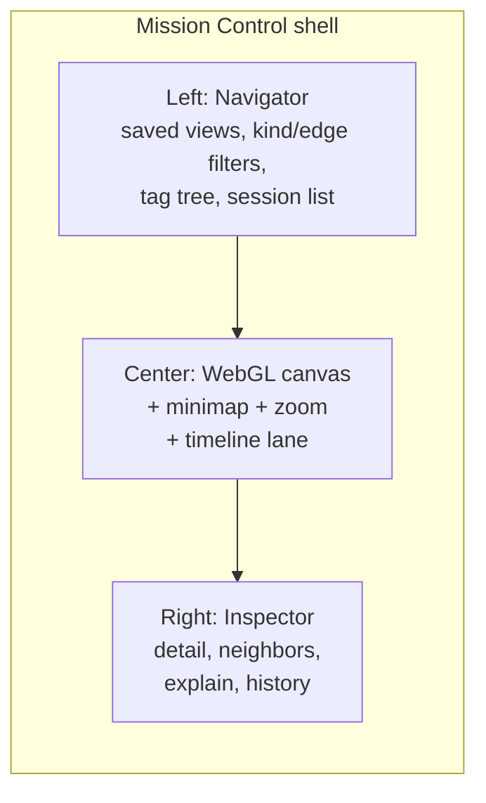

# Viz Redesign Plan — "Mission Control"

> **Status:** Design only — implement as its own project after the Neural Cosmos Phase 1–3 update ships.  
> **Related:** Current explorer is `brainkm viz` → [brainkm/brainkm/services/viz_static/](../brainkm/brainkm/services/viz_static/) (3D/2D Neural Cosmos + WebLLM chat).  
> **Goal:** A daily-driver workbench for inspecting and operating the project brain, not a showpiece explorer.

---

## Positioning

| | Neural Cosmos (today) | Mission Control (later) |
|--|----------------------|-------------------------|
| Role | Wow / explore | Operate daily |
| Default render | 3D force graph | **2D-first** WebGL |
| Layout | Overlay panels on canvas | **Three-pane** shell |
| Entry | Search sidebar + Ask chat | **Cmd+K** command palette |
| Themes | Dark only | Light + dark |

Keep Neural Cosmos as **"cinema mode"** behind a toggle; Mission Control becomes the default when ready.

**Assumptions:** live `/api/graph`, `/api/search`, `/api/version` from the current viz update already exist. Mission Control reuses them and adds `/api/views` + `/api/sessions`.

---

## Architecture

- **Rendering:** 2D WebGL via **sigma.js** (+ graphology for model/layouts). Handles 10k+ nodes at 60fps. Spike for one day against the real ~1k–3k node code graph; fallback to canvas `force-graph` if sigma styling is limiting.
- **No Node at install time:** plain ES modules under `viz_static/mission/` (`index.html`, `app.js`, `graph.js`, `palette.js`, `inspector.js`, `timeline.js`, `chat.js`, `theme.css`). If modules grow past ~10, commit a Vite-built bundle into the wheel — still no Node required for end users.
- **Layout:** ForceAtlas2 in a Web Worker; positions computed once then **frozen** (workbench should be stable). "Re-layout" is an explicit action.
- **Server:** same `viz.py`; routes:
  - `GET /mission` — Mission Control UI
  - `GET|POST /api/views` — saved views (`.brain/viz_views.json` or a small table)
  - `GET /api/sessions` — session list + time ranges for the timeline lane

---

## Three-pane layout

- **Left — Navigator** (~260px, collapsible): saved views, filter stack (kinds, relationships, tag tree, confidence/use_count ranges), sessions list. Filter state mirrored in the **URL hash** for shareable bookmarks.
- **Center — Canvas:** sigma.js graph, minimap, zoom-dependent labels (degree-ranked), lasso/box select, context menu (focus, hide, expand neighbors, explain). Bottom edge hosts the **timeline lane**.
- **Right — Inspector** (~320px): tabs — *Detail* (fields + `cursor://` path link), *Neighbors* (grouped by relationship), *Explain* (WebLLM), *History* (supersedes chain as a mini vertical timeline).

---

## Command palette (Cmd+K)

Single keyboard entry point:

| Prefix | Mode | Behavior |
|--------|------|----------|
| (none) | Search | FTS5 `/api/search` + client fuzzy titles; Enter flies to node |
| `>` | Actions | Theme, layout, save view, export PNG/JSON, re-layout, cinema mode, archived toggle |
| `?` | Chat | Routes to WebLLM "Ask your brain"; citations select nodes |
| `via:` | Traverse | e.g. `calls: parse_config` → neighborhood query |

Keyboard-first: arrows, Tab between groups, Esc.

---

## Saved views

A view = named snapshot of filter stack, camera, color-by mode, selected/pinned ids, layout seed. Persisted via `/api/views` (per-project).

**Built-in views to ship:**

1. **Code map** — code nodes colored by top-level directory  
2. **Decisions** — `memory:decision` + `supersedes` edges  
3. **Recent activity** — last 7 days by `updated_at`

---

## Session timeline lane

- Horizontal lane under the canvas (~90px, collapsible).
- Sessions as bars on a time axis; neurons as dots at `valid_from`, colored by kind.
- Brushing a range filters the canvas; clicking a session highlights `session_id` matches and opens the Inspector.
- Data from `/api/sessions`.

---

## Theming

- All colors via CSS custom properties in `theme.css` — no hardcoded hex in JS (sigma reducers read tokens on theme switch).
- Default follows `prefers-color-scheme`; manual toggle persists in `localStorage`.
- Dark: inherit Neural Cosmos palette (obsidian / violet / cyan).  
- Light: paper white, ink text, same accents at WCAG AA contrast.

---

## Milestones

1. **Spike** (~1 day): sigma.js vs force-graph on real code graph → `remember` the decision.
2. **Shell:** three-pane layout, theme system, `/mission` route, static graph with kind colors.
3. **Interaction:** filters, URL-hash state, inspector detail/neighbors, hover/select.
4. **Palette:** search + actions + traverse syntax.
5. **Views + timeline:** `/api/views`, `/api/sessions`, built-ins, brushable lane.
6. **Chat:** wire existing WebLLM worker into palette `?` and Inspector Explain.
7. **Cutover:** keep both UIs or default Mission Control with cosmos as cinema mode.

---

## Verification

- Extend `tests/test_viz.py`: `/mission` serves, `/api/views` round-trips, `/api/sessions` shape, packaged `viz_static/mission/`.
- Manual: 10k-node synthetic stress, theme contrast (WCAG AA), palette keyboard-only walkthrough, timeline brushing on a multi-session brain.

---

## Out of scope (this doc)

- Implementing Mission Control code (do that in a dedicated effort).
- Replacing MCP tools or changing brain.db schema beyond optional views storage.
- Cloud LLM backends — keep privacy: on-device WebLLM + local FTS5 only.
